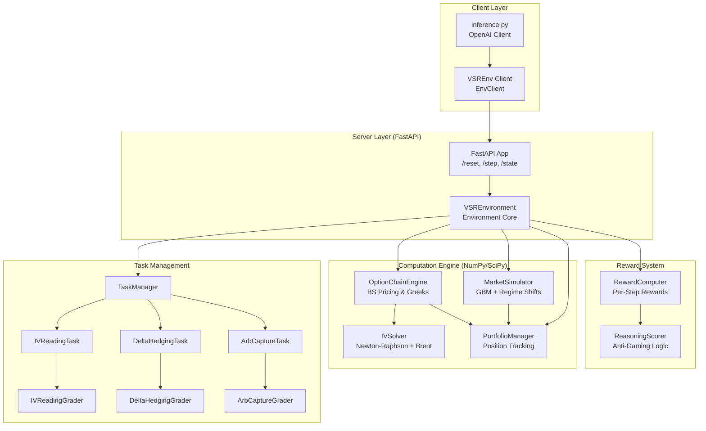

# Design Document: VSR-Env (Volatility Surface Reasoning Environment)

## Overview

VSR-Env is an OpenEnv-compliant reinforcement learning environment that simulates options portfolio management on implied volatility surfaces. The environment targets the Meta PyTorch OpenEnv Hackathon and provides a realistic simulation of quantitative trading workflows used in the $600T+ notional derivatives market.

The system enables LLM agents to act as junior options traders, performing three core tasks:
1. **IV Reading (Easy)**: Identify mispriced options by analyzing volatility surface anomalies
2. **Delta Hedging (Medium)**: Neutralize portfolio risk by managing Greek exposures cost-efficiently
3. **Arbitrage Capture (Hard)**: Execute full arbitrage workflows including detection, trading, hedging, and profit-taking through regime shifts

The environment provides meaningful per-step rewards, deterministic grading with seeded RNG, and runs entirely on CPU using NumPy/SciPy for mathematical computations. It deploys via Docker to HuggingFace Spaces and includes a baseline inference script using the OpenAI client.

## Architecture

### System Components



### Component Responsibilities

**VSREnvironment**: Core environment implementing OpenEnv interface. Manages episode lifecycle, coordinates tasks, computes rewards, and maintains state.

**OptionChainEngine**: Performs all options mathematics using vectorized NumPy operations. Computes Black-Scholes prices, Greeks (delta, gamma, vega, theta), and generates realistic IV surfaces with skew and term structure.

**IVSolver**: Solves for implied volatility from market prices using Newton-Raphson method with Brent's method fallback for numerical stability in low-vega regions.

**MarketSimulator**: Generates realistic price dynamics using Geometric Brownian Motion. Implements regime shifts for the hard task by modifying volatility parameters mid-episode.

**PortfolioManager**: Tracks open positions, computes aggregate Greeks, and calculates mark-to-market P&L based on current market prices.

**TaskManager**: Initializes task-specific state (mispriced options, initial portfolio, regime parameters) and coordinates with task-specific graders.

**Graders**: Deterministic scoring functions returning values in [0.0, 1.0]. Each task has a dedicated grader implementing specific evaluation logic.

**RewardComputer**: Computes per-step rewards with partial progress signals. Decomposes rewards into components (P&L, Greek quality, identification, reasoning).

**ReasoningScorer**: Evaluates reasoning quality using keyword presence and numeric consistency checks to resist gaming.

### Data Flow

1. **Reset Flow**: Client calls reset(task_name, seed) → Environment initializes seeded RNG → TaskManager sets up task-specific state → OptionChainEngine generates IV surface → Returns VSRObservation
2. **Step Flow**: Client sends VSRAction → Environment validates action → PortfolioManager updates positions → MarketSimulator advances market → RewardComputer calculates reward → Returns observation, reward, done, info
3. **Grading Flow**: On episode completion → Grader analyzes episode history → Computes final score in [0.0, 1.0] → Returns in info dict

## Components and Interfaces

### Pydantic Models

All models inherit from `pydantic.BaseModel` for OpenEnv compliance and type safety.

#### VSRAction

```python
class TradeDirection(str, Enum):
    BUY = "buy"
    SELL = "sell"
    HOLD = "hold"

class VSRAction(BaseModel):
    selected_strike: int = Field(..., ge=0, le=7, description="Strike index (0-7)")
    selected_maturity: int = Field(..., ge=0, le=2, description="Maturity index (0-2)")
    direction: TradeDirection = Field(..., description="Trade direction")
    quantity: float = Field(0.0, ge=0.0, le=10.0, description="Trade size in contracts")
    reasoning: str = Field("", description="Agent's analysis and trade thesis")
```

#### VSRObservation

```python
class VSRObservation(BaseModel):
    iv_surface: List[List[float]] = Field(..., description="8×3 implied volatility matrix")
    spot_price: float = Field(..., description="Current underlying price")
    portfolio_greeks: Dict[str, float] = Field(..., description="Delta, gamma, vega, theta")
    portfolio_pnl: float = Field(0.0, description="Cumulative profit/loss")
    portfolio_positions: List[Dict] = Field(default_factory=list, description="Open positions")
    market_sentiment: float = Field(0.0, ge=-1.0, le=1.0, description="Sentiment indicator")
    step_number: int = Field(0, description="Current step in episode")
    steps_remaining: int = Field(10, description="Steps until episode end")
    task_name: str = Field("", description="Current task identifier")
    task_description: str = Field("", description="Task objective")
    last_action_error: Optional[str] = Field(None, description="Validation error from last action")
```

#### VSRState

```python
class VSRState(BaseModel):
    episode_id: str = Field(default="", description="Unique episode identifier")
    step_count: int = Field(0, description="Steps taken in current episode")
    task_name: str = Field("", description="Active task name")
    true_mispriced_strikes: List[int] = Field(default_factory=list, description="Hidden mispriced strike indices")
    true_mispriced_directions: Dict[int, str] = Field(default_factory=dict, description="Hidden mispricing directions")
    regime: str = Field("normal", description="Current market regime")
    spot_price: float = Field(100.0, description="Current underlying price")
    variance: float = Field(0.04, description="Current variance for simulation")
    portfolio_delta: float = Field(0.0, description="Portfolio delta exposure")
    portfolio_gamma: float = Field(0.0, description="Portfolio gamma exposure")
    portfolio_vega: float = Field(0.0, description="Portfolio vega exposure")
    portfolio_pnl: float = Field(0.0, description="Portfolio profit/loss")
    positions: List[Dict] = Field(default_factory=list, description="Position details")
```

#### VSRReward

```python
class VSRReward(BaseModel):
    total: float = Field(..., description="Aggregate reward for step")
    pnl_component: float = Field(0.0, description="Profit/loss contribution")
    greek_component: float = Field(0.0, description="Greek neutrality contribution")
    identification_component: float = Field(0.0, description="Mispricing identification contribution")
    reasoning_component: float = Field(0.0, description="Reasoning quality contribution")
```

### Core Interfaces

#### Environment Interface

```python
class VSREnvironment(Environment):
    def reset(self, task_name: str = "iv_reading", seed: int = 42) -> VSRObservation:
        """Initialize new episode with seeded RNG for reproducibility."""
        
    def step(self, action: VSRAction) -> dict:
        """Execute action and return {observation, reward, done, info}."""
        
    @property
    def state(self) -> VSRState:
        """Return current internal state including hidden information."""
```

#### Grader Interface

```python
class Grader(ABC):
    @abstractmethod
    def score(self, episode_history: List[dict], state: VSRState) -> float:
        """Compute final score in [0.0, 1.0] from episode history."""
```

#### Task Interface

```python
class Task(ABC):
    @abstractmethod
    def initialize(self, env_state: VSRState, rng: np.random.RandomState) -> None:
        """Set up task-specific initial conditions."""
        
    @abstractmethod
    def get_description(self) -> str:
        """Return task objective description for agent."""
```

## Data Models

### Option Chain Representation

The environment uses 8 strikes and 3 maturities for computational efficiency while maintaining realism:

```python
STRIKES = [85, 90, 95, 97.5, 100, 102.5, 105, 110]  # 8 strikes around ATM
MATURITIES = [30/365, 90/365, 180/365]              # 1M, 3M, 6M in years
```

IV surface is represented as an 8×3 matrix where `surface[i][j]` is the implied volatility for strike `i` and maturity `j`.

### Position Representation

Each position is stored as a dictionary:

```python
{
    "strike_idx": int,           # Index into STRIKES array
    "maturity_idx": int,         # Index into MATURITIES array
    "direction": str,            # "buy" or "sell"
    "quantity": float,           # Number of contracts
    "entry_price": float,        # Option price at entry
    "entry_iv": float,           # IV at entry
    "entry_spot": float,         # Spot price at entry
    "current_price": float,      # Current option price
    "pnl": float,                # Mark-to-market P&L
    "delta": float,              # Position delta
    "gamma": float,              # Position gamma
    "vega": float                # Position vega
}
```

### Episode History

Episode history is maintained as a list of step records:

```python
{
    "action": VSRAction,
    "observation": VSRObservation,
    "reward": VSRReward,
    "state_snapshot": dict       # For debugging/analysis
}
```

## Black-Scholes Pricing and Greeks

### Vectorized Black-Scholes Implementation

All computations use vectorized NumPy operations for efficiency on CPU:

```python
def bs_price(S, K, T, r, sigma, option_type='call'):
    """
    Vectorized Black-Scholes pricing.
    
    Args:
        S: Spot price (scalar)
        K: Strike prices (array)
        T: Times to maturity (array)
        r: Risk-free rate (scalar)
        sigma: Volatilities (array matching K×T shape)
        option_type: 'call' or 'put'
    
    Returns:
        Array of option prices
    """
    d1 = (np.log(S / K) + (r + 0.5 * sigma**2) * T) / (sigma * np.sqrt(T))
    d2 = d1 - sigma * np.sqrt(T)
    
    if option_type == 'call':
        return S * norm.cdf(d1) - K * np.exp(-r * T) * norm.cdf(d2)
    else:
        return K * np.exp(-r * T) * norm.cdf(-d2) - S * norm.cdf(-d1)
```

### Greeks Computation

```python
def delta(S, K, T, r, sigma, option_type='call'):
    """First derivative with respect to spot."""
    d1 = (np.log(S / K) + (r + 0.5 * sigma**2) * T) / (sigma * np.sqrt(T))
    return norm.cdf(d1) if option_type == 'call' else norm.cdf(d1) - 1

def gamma(S, K, T, r, sigma):
    """Second derivative with respect to spot."""
    d1 = (np.log(S / K) + (r + 0.5 * sigma**2) * T) / (sigma * np.sqrt(T))
    return norm.pdf(d1) / (S * sigma * np.sqrt(T))

def vega(S, K, T, r, sigma):
    """Derivative with respect to volatility."""
    d1 = (np.log(S / K) + (r + 0.5 * sigma**2) * T) / (sigma * np.sqrt(T))
    return S * norm.pdf(d1) * np.sqrt(T) / 100  # Per 1% vol change

def theta(S, K, T, r, sigma, option_type='call'):
    """Derivative with respect to time (negative of time decay)."""
    d1 = (np.log(S / K) + (r + 0.5 * sigma**2) * T) / (sigma * np.sqrt(T))
    d2 = d1 - sigma * np.sqrt(T)
    
    term1 = -(S * norm.pdf(d1) * sigma) / (2 * np.sqrt(T))
    
    if option_type == 'call':
        term2 = -r * K * np.exp(-r * T) * norm.cdf(d2)
    else:
        term2 = r * K * np.exp(-r * T) * norm.cdf(-d2)
    
    return (term1 + term2) / 365  # Per day
```

### Implied Volatility Solver

Two-stage approach for numerical stability:

**Stage 1: Newton-Raphson** (fast convergence when vega is non-zero)

```python
def implied_vol_newton(market_price, S, K, T, r, option_type='call', 
                       tol=1e-6, max_iter=100):
    """
    Newton-Raphson IV solver.
    
    Iteration: sigma_new = sigma_old - (price - market_price) / vega
    """
    sigma = 0.2  # Initial guess
    
    for i in range(max_iter):
        price = bs_price(S, K, T, r, sigma, option_type)
        v = vega(S, K, T, r, sigma) * 100  # Undo the /100 scaling
        
        if abs(v) < 1e-8:
            # Vega too small, switch to Brent's method
            return implied_vol_brent(market_price, S, K, T, r, option_type)
        
        diff = price - market_price
        if abs(diff) < tol:
            return sigma
        
        sigma -= diff / v
        sigma = np.clip(sigma, 0.01, 5.0)  # Keep in reasonable range
    
    return sigma
```

**Stage 2: Brent's Method** (guaranteed convergence, no derivative needed)

```python
def implied_vol_brent(market_price, S, K, T, r, option_type, 
                      lo=0.01, hi=5.0, tol=1e-6):
    """
    Brent's method fallback using scipy.optimize.brentq.
    Used when vega is near zero (deep ITM/OTM options).
    """
    from scipy.optimize import brentq
    
    def objective(sigma):
        return bs_price(S, K, T, r, sigma, option_type) - market_price
    
    try:
        return brentq(objective, lo, hi, xtol=tol, maxiter=100)
    except (ValueError, RuntimeError):
        # If even Brent's fails, return intrinsic volatility estimate
        intrinsic_vol = abs(np.log(S / K)) / np.sqrt(T) * 0.5
        return np.clip(intrinsic_vol, 0.05, 3.0)
```

## IV Surface Generation

### Realistic Surface with Skew and Term Structure

```python
def generate_iv_surface(S, rng, base_vol=0.2, skew=-0.02, term_slope=0.01,
                        mispriced_cells=None):
    """
    Generate realistic IV surface with volatility smile/skew.
    
    Args:
        S: Current spot price
        rng: Seeded numpy RandomState for reproducibility
        base_vol: Base volatility level (ATM)
        skew: Skew coefficient (negative = put skew)
        term_slope: Term structure slope (positive = upward sloping)
        mispriced_cells: List of ((strike_idx, mat_idx), direction, magnitude)
    
    Returns:
        8×3 list of implied volatilities
    """
    surface = np.zeros((8, 3))
    
    for i, K in enumerate(STRIKES):
        for j, T in enumerate(MATURITIES):
            # Log-moneyness normalized by sqrt(T)
            moneyness = np.log(K / S) / np.sqrt(T)
            
            # Base IV with skew (smile effect)
            iv = base_vol + skew * moneyness
            
            # Term structure (longer maturities typically higher vol)
            iv += term_slope * np.sqrt(T)
            
            # Add realistic noise
            iv += rng.normal(0, 0.005)
            
            # Ensure positive and reasonable
            surface[i, j] = max(0.05, min(iv, 2.0))
    
    # Inject deliberate mispricings for tasks
    if mispriced_cells:
        for (si, mi), direction, magnitude in mispriced_cells:
            if direction == "over":
                surface[si, mi] += magnitude
            else:  # "under"
                surface[si, mi] -= magnitude
            surface[si, mi] = max(0.05, surface[si, mi])
    
    return surface.tolist()
```

### Mispricing Injection Strategy

For the IV reading task, mispricings are injected with:
- Magnitude: 0.03 to 0.08 (3-8 vol points, clearly detectable)
- Location: Randomly selected but not adjacent cells
- Direction: Mix of overpriced and underpriced

```python
def inject_mispricings(rng, num_mispricings=2):
    """Generate mispricing specifications for IV reading task."""
    cells = []
    used_positions = set()
    
    for _ in range(num_mispricings):
        # Avoid adjacent cells
        while True:
            si = rng.randint(0, 8)
            mi = rng.randint(0, 3)
            if (si, mi) not in used_positions:
                # Mark adjacent cells as used
                for di in [-1, 0, 1]:
                    for dj in [-1, 0, 1]:
                        used_positions.add((si + di, mi + dj))
                break
        
        direction = rng.choice(["over", "under"])
        magnitude = rng.uniform(0.03, 0.08)
        cells.append(((si, mi), direction, magnitude))
    
    return cells
```

## Market Simulation

### Geometric Brownian Motion

Price evolution follows standard GBM:

```python
def advance_market(state, rng, dt=1/252):
    """
    Advance market by one time step using GBM.
    
    dS = μ * S * dt + σ * S * dW
    
    Args:
        state: Current VSRState
        rng: Seeded RandomState
        dt: Time step (default 1 trading day)
    """
    mu = 0.0  # Risk-neutral drift
    sigma = np.sqrt(state.variance)
    
    dW = rng.normal(0, np.sqrt(dt))
    dS = mu * state.spot_price * dt + sigma * state.spot_price * dW
    
    state.spot_price += dS
    state.spot_price = np.clip(state.spot_price, 50.0, 150.0)
    
    # Mean-reverting variance (simple Ornstein-Uhlenbeck)
    theta = 0.1  # Mean reversion speed
    var_mean = 0.04  # Long-term variance
    var_vol = 0.01  # Variance of variance
    
    dV = theta * (var_mean - state.variance) * dt + var_vol * rng.normal(0, np.sqrt(dt))
    state.variance += dV
    state.variance = np.clip(state.variance, 0.01, 0.16)
```

### Regime Shifts

For the arbitrage capture task, regime shifts occur at steps 4-5:

```python
def trigger_regime_shift(state, rng):
    """
    Trigger regime shift by modifying volatility parameters.
    
    Simulates market stress events where volatility spikes or crashes.
    """
    shift_type = rng.choice(["vol_spike", "vol_crash"])
    
    if shift_type == "vol_spike":
        # Volatility increases 20-40%
        multiplier = rng.uniform(1.2, 1.4)
        state.variance *= multiplier
        state.regime = "high_vol"
    else:
        # Volatility decreases 20-30%
        multiplier = rng.uniform(0.7, 0.8)
        state.variance *= multiplier
        state.regime = "low_vol"
    
    state.variance = np.clip(state.variance, 0.01, 0.16)
```

## Task Implementations

### Task 1: IV Reading (Easy)

**Objective**: Identify 2 mispriced options on the IV surface

**Initialization**:
```python
def init_iv_reading(state, rng):
    """Initialize IV reading task."""
    # Generate surface with 2 mispricings
    mispriced_cells = inject_mispricings(rng, num_mispricings=2)
    
    state.true_mispriced_strikes = [si for (si, mi), _, _ in mispriced_cells]
    state.true_mispriced_directions = {
        si: direction for (si, mi), direction, _ in mispriced_cells
    }
    
    # Store for grading
    state.mispriced_cells = mispriced_cells
```

**Grading Logic**:
```python
class IVReadingGrader(Grader):
    def score(self, episode_history, state):
        """
        Score = correct_identifications / 2.0
        
        Partial credit: 0.5 per correct identification
        """
        correct = 0
        identified = set()
        
        for step in episode_history:
            action = step["action"]
            strike_idx = action.selected_strike
            
            # Check if this strike was mispriced
            if strike_idx in state.true_mispriced_strikes:
                # Check if direction matches
                if action.direction.value == state.true_mispriced_directions.get(strike_idx):
                    if strike_idx not in identified:
                        correct += 1
                        identified.add(strike_idx)
        
        return min(correct / 2.0, 1.0)
```

### Task 2: Delta Hedging (Medium)

**Objective**: Neutralize portfolio delta within ±0.05 cost-efficiently

**Initialization**:
```python
def init_delta_hedging(state, rng):
    """Initialize delta hedging task with non-zero delta portfolio."""
    # Create initial position with significant delta
    strike_idx = rng.randint(2, 6)  # Near ATM
    maturity_idx = 1  # 3-month
    direction = rng.choice(["buy", "sell"])
    quantity = rng.uniform(2.0, 5.0)
    
    # Compute position Greeks
    K = STRIKES[strike_idx]
    T = MATURITIES[maturity_idx]
    sigma = 0.2  # Assume ATM vol
    
    price = bs_price(state.spot_price, K, T, 0.05, sigma)
    pos_delta = delta(state.spot_price, K, T, 0.05, sigma) * quantity
    
    if direction == "sell":
        pos_delta *= -1
        price *= -1
    
    state.portfolio_delta = pos_delta
    state.positions = [{
        "strike_idx": strike_idx,
        "maturity_idx": maturity_idx,
        "direction": direction,
        "quantity": quantity,
        "entry_price": price,
        "delta": pos_delta
    }]
    
    state.initial_delta = abs(pos_delta)  # Store for grading
```

**Grading Logic**:
```python
class DeltaHedgingGrader(Grader):
    def score(self, episode_history, state):
        """
        Score = neutralization_quality × 0.7 + cost_efficiency × 0.3
        
        neutralization_quality = max(0, 1.0 - |final_delta| / |initial_delta|)
        cost_efficiency = max(0, 1.0 - total_cost / max_reasonable_cost)
        """
        final_delta = abs(state.portfolio_delta)
        initial_delta = state.initial_delta
        
        # Neutralization quality
        if initial_delta < 1e-6:
            neutralization = 1.0
        else:
            neutralization = max(0, 1.0 - final_delta / initial_delta)
        
        # Cost efficiency
        total_cost = sum(
            abs(step["action"].quantity * 0.01)  # Simplified cost model
            for step in episode_history
            if step["action"].direction != TradeDirection.HOLD
        )
        max_cost = initial_delta * 2.0  # Generous upper bound
        cost_eff = max(0, 1.0 - total_cost / max_cost)
        
        return neutralization * 0.7 + cost_eff * 0.3
```

### Task 3: Arbitrage Capture (Hard)

**Objective**: Full arbitrage workflow with regime shifts

**Initialization**:
```python
def init_arb_capture(state, rng):
    """Initialize arbitrage capture task with exploitable mispricing."""
    # Generate surface with 1 significant mispricing
    mispriced_cells = inject_mispricings(rng, num_mispricings=1)
    state.mispriced_cells = mispriced_cells
    
    # Set regime shift parameters
    state.regime_shift_step = rng.randint(4, 6)
    state.regime = "normal"
```

**Grading Logic**:
```python
class ArbCaptureGrader(Grader):
    def score(self, episode_history, state):
        """
        Score = pnl_score × 0.4 + neutrality_score × 0.3 + reasoning_score × 0.3
        
        pnl_score: Sigmoid-normalized P&L
        neutrality_score: Average delta neutrality over episode
        reasoning_score: Reasoning quality across steps
        """
        # P&L component
        final_pnl = state.portfolio_pnl
        pnl_score = self._sigmoid(final_pnl, scale=0.3)
        
        # Neutrality component
        avg_delta = sum(
            abs(step["observation"].portfolio_greeks.get("delta", 0))
            for step in episode_history
        ) / len(episode_history)
        neutrality_score = max(0, 1.0 - avg_delta / 0.5)
        
        # Reasoning component
        reasoning_scores = [
            self._score_reasoning(step["action"].reasoning, step["observation"], state)
            for step in episode_history
        ]
        reasoning_score = sum(reasoning_scores) / len(reasoning_scores)
        
        return pnl_score * 0.4 + neutrality_score * 0.3 + reasoning_score * 0.3
    
    def _sigmoid(self, x, scale=0.3):
        """Sigmoid centered at 0."""
        return 1.0 / (1.0 + np.exp(-x / scale))
    
    def _score_reasoning(self, reasoning, obs, state):
        """
        Score reasoning quality using keyword presence and numeric consistency.
        
        Returns score in [0.0, 1.0]
        """
        score = 0.0
        text = reasoning.lower()
        
        # Keyword presence (max 0.4)
        domain_keywords = ["delta", "hedge", "neutral", "skew", "smile", "regime",
                          "overpriced", "underpriced", "moneyness", "vega", "gamma"]
        kw_hits = sum(1 for kw in domain_keywords if kw in text)
        score += min(kw_hits / 4.0, 1.0) * 0.4
        
        # Numeric consistency (max 0.6)
        numeric_score = 0.0
        
        # Check spot price citation
        spot_str = f"{state.spot_price:.1f}"
        spot_int = f"{int(round(state.spot_price))}"
        if spot_str in reasoning or spot_int in reasoning:
            numeric_score += 0.25
        
        # Check IV value citations
        iv_values_cited = 0
        for row in obs.iv_surface:
            for iv_val in row:
                if f"{iv_val:.2f}" in reasoning or f"{iv_val*100:.0f}%" in reasoning:
                    iv_values_cited += 1
        if iv_values_cited >= 1:
            numeric_score += 0.15
        if iv_values_cited >= 2:
            numeric_score += 0.1
        
        # Check portfolio delta citation
        delta_val = state.portfolio_delta
        if f"{delta_val:.2f}" in reasoning or f"{delta_val:.1f}" in reasoning:
            numeric_score += 0.1
        
        score += numeric_score
        
        # Length penalty for trivial reasoning
        if len(reasoning) <= 20:
            score *= 0.3
        
        return min(score, 1.0)
```


## Reward Computation System

The reward system provides meaningful per-step signals that enable agents to learn from trajectory feedback. All rewards are normalized to contribute to a total in the approximate range [0.0, 1.0].

### IV Reading Reward Formula

```python
def compute_iv_reading_reward(action, state, obs):
    """
    Reward = identification_component + reasoning_component × 0.2
    
    identification_component:
      - 0.5 if correct strike and correct direction
      - 0.1 if correct strike but wrong direction
      - 0.0 otherwise
    
    reasoning_component: scored in [0.0, 1.0], weighted by 0.2
    """
    identification = 0.0
    
    if action.selected_strike in state.true_mispriced_strikes:
        expected_direction = state.true_mispriced_directions[action.selected_strike]
        if action.direction.value == expected_direction:
            identification = 0.5  # Correct identification
        else:
            identification = 0.1  # Right strike, wrong direction
    
    reasoning = score_reasoning_quality(action.reasoning, obs, state)
    
    total = min(identification + reasoning * 0.2, 1.0)
    
    return VSRReward(
        total=total,
        identification_component=identification,
        reasoning_component=reasoning * 0.2
    )
```

### Delta Hedging Reward Formula

```python
def compute_delta_hedging_reward(action, state, prev_delta):
    """
    Reward = delta_improvement × 0.6 + cost_efficiency × 0.4 + neutrality_bonus
    
    delta_improvement: Fractional reduction in |delta|
    cost_efficiency: Inverse of normalized trade cost
    neutrality_bonus: 0.1 if |delta| < 0.05, else 0.0
    """
    new_delta = abs(state.portfolio_delta)
    old_delta = abs(prev_delta)
    
    # Delta improvement component (0.0 - 0.6)
    if old_delta > 1e-6:
        improvement = max(0, (old_delta - new_delta) / old_delta)
    else:
        improvement = 1.0 if new_delta < 0.05 else 0.0
    delta_reward = improvement * 0.6
    
    # Cost efficiency component (0.0 - 0.4)
    trade_cost = abs(action.quantity) * 0.01  # Simplified cost model
    cost_reward = max(0, 0.4 - trade_cost * 0.1)
    
    # Neutrality bonus (0.0 or 0.1)
    neutrality_bonus = 0.1 if new_delta < 0.05 else 0.0
    
    total = min(delta_reward + cost_reward + neutrality_bonus, 1.0)
    
    return VSRReward(
        total=total,
        greek_component=delta_reward + neutrality_bonus,
        pnl_component=cost_reward
    )
```


### Arbitrage Capture Reward Formula

```python
def compute_arb_capture_reward(action, state, prev_pnl, obs):
    """
    Reward = pnl_component × 0.4 + greek_component × 0.3 + reasoning_component × 0.3
    
    pnl_component: Sigmoid-normalized P&L change
    greek_component: Delta neutrality quality
    reasoning_component: Reasoning quality score
    """
    # P&L improvement (0.0 - 0.4)
    pnl_change = state.portfolio_pnl - prev_pnl
    pnl_reward = sigmoid(pnl_change, scale=0.3) * 0.4
    
    # Greek neutrality (0.0 - 0.3)
    delta_penalty = min(abs(state.portfolio_delta) / 0.5, 1.0)
    greek_reward = (1.0 - delta_penalty) * 0.3
    
    # Reasoning coherence (0.0 - 0.3)
    reasoning_reward = score_reasoning_quality(action.reasoning, obs, state) * 0.3
    
    total = min(pnl_reward + greek_reward + reasoning_reward, 1.0)
    
    return VSRReward(
        total=total,
        pnl_component=pnl_reward,
        greek_component=greek_reward,
        reasoning_component=reasoning_reward
    )

def sigmoid(x, scale=0.3):
    """
    Sigmoid centered at 0.
    
    Scale calibration:
    - scale=0.3 means P&L of +0.3 → 0.73, P&L of +0.1 → 0.59
    - Typical step P&L range: 0.01 to 0.5
    """
    return 1.0 / (1.0 + math.exp(-x / scale))
```

### Reward Component Breakdown

Each VSRReward object contains:

- **total**: Aggregate reward for the step (sum of components, clamped to [0.0, 1.0])
- **pnl_component**: Contribution from profit/loss changes
- **greek_component**: Contribution from Greek neutrality (delta management)
- **identification_component**: Contribution from correct mispricing identification
- **reasoning_component**: Contribution from reasoning quality

This decomposition enables analysis of which reward components drive agent behavior and facilitates reward shaping experiments.


## Reasoning Quality Scoring

The reasoning scorer evaluates agent explanations using two complementary mechanisms to resist gaming:

### Keyword Presence Scoring (Maximum 0.4)

```python
def score_keyword_presence(reasoning_text):
    """
    Award points for domain-relevant keywords.
    Easy to achieve baseline, but insufficient alone.
    """
    text = reasoning_text.lower()
    domain_keywords = [
        "delta", "hedge", "neutral", "skew", "smile", "regime",
        "overpriced", "underpriced", "moneyness", "vega", "gamma",
        "theta", "volatility", "arbitrage", "mispricing"
    ]
    
    keyword_hits = sum(1 for keyword in domain_keywords if keyword in text)
    score = min(keyword_hits / 4.0, 1.0) * 0.4
    
    return score
```

### Numeric Consistency Scoring (Maximum 0.6)

This component is harder to game as it requires citing actual values from the observation:

```python
def score_numeric_consistency(reasoning, observation, state):
    """
    Award points for citing actual numeric values from the observation.
    Prevents keyword-stuffing without genuine analysis.
    """
    score = 0.0
    
    # Spot price citation check (0.25 points)
    spot_str = f"{state.spot_price:.1f}"
    spot_int = f"{int(round(state.spot_price))}"
    if spot_str in reasoning or spot_int in reasoning:
        score += 0.25
    
    # IV value citation check (0.25 points total)
    iv_values_cited = 0
    for row in observation.iv_surface:
        for iv_val in row:
            # Check for decimal format (e.g., "0.22") or percentage (e.g., "22%")
            if f"{iv_val:.2f}" in reasoning or f"{iv_val*100:.0f}%" in reasoning:
                iv_values_cited += 1
    
    if iv_values_cited >= 1:
        score += 0.15
    if iv_values_cited >= 2:
        score += 0.10  # Bonus for citing multiple IV values
    
    # Portfolio delta citation check (0.1 points)
    delta_val = state.portfolio_delta
    if f"{delta_val:.2f}" in reasoning or f"{delta_val:.1f}" in reasoning:
        score += 0.1
    
    return score
```


### Length Penalty for Trivial Reasoning

```python
def apply_length_penalty(score, reasoning_text):
    """
    Penalize trivially short reasoning to prevent gaming.
    
    Reasoning with ≤20 characters receives only 30% of computed score.
    """
    if len(reasoning_text) <= 20:
        return score * 0.3
    return score
```

### Complete Reasoning Scoring Function

```python
def score_reasoning_quality(reasoning, observation, state):
    """
    Complete reasoning quality scorer with anti-gaming mechanisms.
    
    Returns score in [0.0, 1.0]
    
    Components:
    - Keyword presence: max 0.4 (easy baseline)
    - Numeric consistency: max 0.6 (hard to game)
    - Length penalty: 0.3× multiplier if ≤20 chars
    """
    score = 0.0
    
    # Component 1: Keyword presence (max 0.4)
    score += score_keyword_presence(reasoning)
    
    # Component 2: Numeric consistency (max 0.6)
    score += score_numeric_consistency(reasoning, observation, state)
    
    # Apply length penalty
    score = apply_length_penalty(score, reasoning)
    
    # Clamp to valid range
    return min(max(score, 0.0), 1.0)
```

### Anti-Gaming Design Rationale

The two-component design prevents common gaming strategies:

1. **Keyword stuffing**: An agent that outputs "delta hedge neutral skew gamma vega" gets only 0.4/1.0
2. **Generic templates**: Without citing actual observation values, score is capped at 0.4
3. **Trivial output**: Single-word or empty reasoning receives heavy penalty (0.3× multiplier)
4. **Genuine analysis required**: To achieve >0.7, agent must cite spot price, multiple IV values, and portfolio delta

This design ensures reasoning scores correlate with genuine observation analysis rather than template exploitation.


## Portfolio Management

The portfolio manager tracks all open positions, computes aggregate Greeks, and calculates mark-to-market P&L.

### Position Addition Logic

```python
def add_position(portfolio, action, state, engine):
    """
    Add a new position to the portfolio based on executed action.
    
    Args:
        portfolio: Current portfolio state
        action: VSRAction with strike, maturity, direction, quantity
        state: Current VSRState with spot price and variance
        engine: OptionChainEngine for pricing and Greeks
    """
    strike_idx = action.selected_strike
    maturity_idx = action.selected_maturity
    
    K = STRIKES[strike_idx]
    T = MATURITIES[maturity_idx]
    S = state.spot_price
    sigma = np.sqrt(state.variance)
    r = 0.05
    
    # Compute entry price and Greeks
    entry_price = engine.bs_price(S, K, T, r, sigma, option_type='call')
    pos_delta = engine.delta(S, K, T, r, sigma)
    pos_gamma = engine.gamma(S, K, T, r, sigma)
    pos_vega = engine.vega(S, K, T, r, sigma)
    
    # Adjust sign based on direction
    quantity_signed = action.quantity if action.direction == "buy" else -action.quantity
    
    position = {
        "strike_idx": strike_idx,
        "maturity_idx": maturity_idx,
        "direction": action.direction.value,
        "quantity": action.quantity,
        "entry_price": entry_price,
        "entry_iv": sigma,
        "entry_spot": S,
        "current_price": entry_price,
        "pnl": 0.0,
        "delta": pos_delta * quantity_signed,
        "gamma": pos_gamma * quantity_signed,
        "vega": pos_vega * quantity_signed
    }
    
    portfolio.positions.append(position)
```

### Position Removal Logic

```python
def remove_position(portfolio, position_idx):
    """
    Remove a position from the portfolio (e.g., when closing).
    
    Args:
        portfolio: Current portfolio state
        position_idx: Index of position to remove
    """
    if 0 <= position_idx < len(portfolio.positions):
        portfolio.positions.pop(position_idx)
```


### Greek Aggregation Across Positions

```python
def compute_portfolio_greeks(portfolio, state, engine):
    """
    Aggregate Greeks across all positions.
    
    Portfolio Greeks = sum of individual position Greeks
    """
    total_delta = 0.0
    total_gamma = 0.0
    total_vega = 0.0
    total_theta = 0.0
    
    S = state.spot_price
    sigma = np.sqrt(state.variance)
    r = 0.05
    
    for pos in portfolio.positions:
        K = STRIKES[pos["strike_idx"]]
        T = MATURITIES[pos["maturity_idx"]]
        
        # Recompute Greeks at current market conditions
        delta = engine.delta(S, K, T, r, sigma)
        gamma = engine.gamma(S, K, T, r, sigma)
        vega = engine.vega(S, K, T, r, sigma)
        theta = engine.theta(S, K, T, r, sigma)
        
        # Apply position quantity and direction
        quantity_signed = pos["quantity"] if pos["direction"] == "buy" else -pos["quantity"]
        
        total_delta += delta * quantity_signed
        total_gamma += gamma * quantity_signed
        total_vega += vega * quantity_signed
        total_theta += theta * quantity_signed
    
    return {
        "delta": total_delta,
        "gamma": total_gamma,
        "vega": total_vega,
        "theta": total_theta
    }
```

### Mark-to-Market P&L Calculation

```python
def compute_portfolio_pnl(portfolio, state, engine):
    """
    Calculate mark-to-market P&L for all positions.
    
    P&L = sum((current_price - entry_price) × quantity × direction_multiplier)
    """
    total_pnl = 0.0
    
    S = state.spot_price
    sigma = np.sqrt(state.variance)
    r = 0.05
    
    for pos in portfolio.positions:
        K = STRIKES[pos["strike_idx"]]
        T = MATURITIES[pos["maturity_idx"]]
        
        # Current market price
        current_price = engine.bs_price(S, K, T, r, sigma, option_type='call')
        
        # P&L calculation
        if pos["direction"] == "buy":
            pnl = (current_price - pos["entry_price"]) * pos["quantity"]
        else:  # sell
            pnl = (pos["entry_price"] - current_price) * pos["quantity"]
        
        pos["current_price"] = current_price
        pos["pnl"] = pnl
        total_pnl += pnl
    
    return total_pnl
```


### Position Update on Market Moves

```python
def update_positions_on_market_move(portfolio, state, engine):
    """
    Update all position Greeks and P&L after market moves.
    
    Called after each step's market simulation.
    """
    # Recompute Greeks
    greeks = compute_portfolio_greeks(portfolio, state, engine)
    state.portfolio_delta = greeks["delta"]
    state.portfolio_gamma = greeks["gamma"]
    state.portfolio_vega = greeks["vega"]
    
    # Recompute P&L
    pnl = compute_portfolio_pnl(portfolio, state, engine)
    state.portfolio_pnl = pnl
```

### Portfolio State Representation

The portfolio state is maintained in VSRState:

```python
class VSRState(BaseModel):
    # ... other fields ...
    
    portfolio_delta: float = 0.0
    portfolio_gamma: float = 0.0
    portfolio_vega: float = 0.0
    portfolio_pnl: float = 0.0
    positions: List[Dict] = Field(default_factory=list)
```

Each position dictionary contains:
- `strike_idx`, `maturity_idx`: Position specification
- `direction`: "buy" or "sell"
- `quantity`: Number of contracts
- `entry_price`, `entry_iv`, `entry_spot`: Entry conditions
- `current_price`: Current market price
- `pnl`: Mark-to-market profit/loss
- `delta`, `gamma`, `vega`: Position Greeks


## Action Validation

The environment validates all actions before execution to ensure they are within valid ranges and provide clear error messages.

### Validation Rules

```python
def validate_action(action: VSRAction) -> Optional[str]:
    """
    Validate action parameters.
    
    Returns:
        None if valid, error message string if invalid
    """
    # Strike index validation
    if action.selected_strike < 0 or action.selected_strike > 7:
        return "Invalid strike index: must be in range [0, 7]"
    
    # Maturity index validation
    if action.selected_maturity < 0 or action.selected_maturity > 2:
        return "Invalid maturity index: must be in range [0, 2]"
    
    # Quantity validation
    if action.quantity < 0:
        return "Quantity must be non-negative"
    
    if action.quantity > 10.0:
        return "Quantity exceeds maximum of 10 contracts"
    
    # Direction validation
    if action.direction not in [TradeDirection.BUY, TradeDirection.SELL, TradeDirection.HOLD]:
        return "Invalid direction: must be 'buy', 'sell', or 'hold'"
    
    # Hold action must have zero quantity
    if action.direction == TradeDirection.HOLD and action.quantity != 0:
        return "Hold action must have quantity of 0"
    
    return None  # Valid action
```

### Error Message Format

Error messages are:
- Clear and actionable
- Specify the invalid parameter
- Indicate the valid range or constraint
- Returned in the `last_action_error` field of VSRObservation

### Error Handling in Step Function

```python
def step(self, action: VSRAction) -> dict:
    """Execute action with validation."""
    self._state.step_count += 1
    
    # Validate action
    error = validate_action(action)
    
    if error is None:
        # Execute valid action
        self._execute_action(action)
        self._advance_market()
        reward = self._compute_reward(action, error=None)
    else:
        # Invalid action: no state change, zero reward
        reward = VSRReward(total=0.0)
    
    # Build observation with error message if present
    obs = self._make_observation(error=error)
    
    # ... rest of step logic
```

### Validation Error Behavior

When an action validation error occurs:
1. The error message is set in `observation.last_action_error`
2. Portfolio state is NOT modified
3. Market still advances (time passes)
4. Reward is zero for that step
5. Episode continues (not terminated)

This design allows agents to recover from invalid actions without episode termination.


## Deployment Architecture

### FastAPI Server Structure

```python
# vsr_env/server/app.py

from fastapi import FastAPI, HTTPException
from vsr_env.models import VSRAction, VSRObservation, VSRState, VSRReward
from vsr_env.server.vsr_environment import VSREnvironment

app = FastAPI(
    title="VSR-Env",
    description="Volatility Surface Reasoning Environment",
    version="1.0.0"
)

# Global environment instance
env = VSREnvironment()

@app.get("/health")
async def health_check():
    """Health check endpoint for Docker."""
    return {"status": "healthy", "environment": "vsr_env"}

@app.post("/reset")
async def reset(task_name: str = "iv_reading", seed: int = 42):
    """Reset environment to initial state."""
    try:
        observation = env.reset(task_name=task_name, seed=seed)
        return {"observation": observation.dict()}
    except Exception as e:
        raise HTTPException(status_code=500, detail=str(e))

@app.post("/step")
async def step(action: VSRAction):
    """Execute one environment step."""
    try:
        result = env.step(action)
        return {
            "observation": result["observation"].dict(),
            "reward": result["reward"],
            "done": result["done"],
            "info": result["info"]
        }
    except Exception as e:
        raise HTTPException(status_code=500, detail=str(e))

@app.get("/state")
async def get_state():
    """Get current environment state."""
    try:
        return {"state": env.state.dict()}
    except Exception as e:
        raise HTTPException(status_code=500, detail=str(e))
```


### Docker Configuration

```dockerfile
# Dockerfile

FROM python:3.11-slim

WORKDIR /app

# Install system dependencies
RUN apt-get update && apt-get install -y \
    curl \
    && rm -rf /var/lib/apt/lists/*

# Copy and install Python dependencies
COPY requirements.txt .
RUN pip install --no-cache-dir -r requirements.txt

# Copy application code
COPY . .

# Install package in development mode
RUN pip install -e .

# Health check
HEALTHCHECK --interval=30s --timeout=3s --start-period=5s --retries=3 \
    CMD curl -f http://localhost:8000/health || exit 1

# Expose port
EXPOSE 8000

# Run server
CMD ["uvicorn", "vsr_env.server.app:app", "--host", "0.0.0.0", "--port", "8000"]
```

### Requirements File

```txt
# requirements.txt

openenv-core>=0.1.0
fastapi>=0.104.0
uvicorn[standard]>=0.24.0
pydantic>=2.0.0
numpy>=1.24.0
scipy>=1.10.0
```

### HuggingFace Spaces Deployment

**README.md for HF Space:**

```markdown
---
title: VSR-Env
emoji: 📈
colorFrom: blue
colorTo: green
sdk: docker
pinned: false
tags:
  - openenv
  - reinforcement-learning
  - options-trading
  - quantitative-finance
---

# VSR-Env: Volatility Surface Reasoning Environment

OpenEnv-compliant environment for options portfolio management.

## Endpoints

- `POST /reset?task_name=iv_reading&seed=42`
- `POST /step` (body: VSRAction JSON)
- `GET /state`
- `GET /health`
```


### Environment Variables

The deployment requires the following environment variables:

```bash
# Required for inference script
API_BASE_URL=https://router.huggingface.co/v1
MODEL_NAME=Qwen/Qwen2.5-72B-Instruct
HF_TOKEN=hf_xxxxxxxxxxxxxxxxxxxxx

# Optional
IMAGE_NAME=vsr-env:latest
VSR_ENV_URL=http://localhost:8000
LOG_LEVEL=INFO
```

### Health Check Endpoint

The `/health` endpoint returns:

```json
{
  "status": "healthy",
  "environment": "vsr_env"
}
```

This endpoint is used by:
- Docker HEALTHCHECK directive
- HuggingFace Spaces monitoring
- Pre-validation script
- Load balancers

### Deployment Steps

1. **Build Docker image:**
   ```bash
   docker build -t vsr-env:latest .
   ```

2. **Test locally:**
   ```bash
   docker run -p 8000:8000 vsr-env:latest
   curl http://localhost:8000/health
   ```

3. **Deploy to HuggingFace Spaces:**
   - Create new Space with Docker SDK
   - Push code to Space repository
   - Set environment variables in Space settings
   - Space automatically builds and deploys

4. **Verify deployment:**
   ```bash
   curl -X POST https://YOUR-SPACE.hf.space/reset
   ```


## Baseline Inference Script Design

The baseline inference script demonstrates environment usage and establishes baseline scores for all three tasks.

### OpenAI Client Configuration

```python
import os
from openai import OpenAI

# Initialize client with environment variables
API_BASE_URL = os.getenv("API_BASE_URL", "https://router.huggingface.co/v1")
API_KEY = os.getenv("HF_TOKEN") or os.getenv("API_KEY")
MODEL_NAME = os.getenv("MODEL_NAME", "Qwen/Qwen2.5-72B-Instruct")

client = OpenAI(
    base_url=API_BASE_URL,
    api_key=API_KEY
)
```

### Prompt Building Strategy

```python
def build_prompt(observation, task_name, step_number):
    """
    Build observation prompt for LLM.
    
    Includes:
    - Task description
    - IV surface formatted as table
    - Current market state (spot, Greeks, P&L)
    - Portfolio positions
    - Last action error (if any)
    """
    iv_table = "\n".join([
        f"  Strike {i} ({STRIKES[i]}): {row}"
        for i, row in enumerate(observation.iv_surface)
    ])
    
    prompt = f"""Step {step_number}/{observation.steps_remaining + step_number}
Task: {observation.task_description}

IV Surface (8 strikes × 3 maturities):
{iv_table}

Market State:
- Spot Price: {observation.spot_price:.2f}
- Portfolio Delta: {observation.portfolio_greeks.get('delta', 0):.4f}
- Portfolio Gamma: {observation.portfolio_greeks.get('gamma', 0):.6f}
- Portfolio Vega: {observation.portfolio_greeks.get('vega', 0):.4f}
- Portfolio P&L: {observation.portfolio_pnl:.2f}
- Market Sentiment: {observation.market_sentiment:.2f}

Current Positions: {observation.portfolio_positions}
"""
    
    if observation.last_action_error:
        prompt += f"\nLast Action Error: {observation.last_action_error}\n"
    
    prompt += "\nRespond with your action as JSON."
    
    return prompt
```


### Response Parsing Logic

```python
import json

def parse_llm_response(response_text):
    """
    Parse JSON action from LLM response.
    
    Handles:
    - Clean JSON responses
    - JSON embedded in markdown code blocks
    - Malformed responses (returns safe default)
    """
    try:
        # Try direct JSON parse
        return json.loads(response_text)
    except json.JSONDecodeError:
        pass
    
    try:
        # Try extracting JSON from text
        start = response_text.find("{")
        end = response_text.rfind("}") + 1
        if start >= 0 and end > start:
            return json.loads(response_text[start:end])
    except json.JSONDecodeError:
        pass
    
    # Return safe default (hold action)
    return {
        "strike_idx": 0,
        "maturity_idx": 0,
        "direction": "hold",
        "quantity": 0,
        "reasoning": "parse error"
    }
```

### Stdout Logging Format

The inference script must output in the exact format specified:

```python
def log_start(task, env, model):
    """Log task start."""
    print(f"[START] task={task} env={env} model={model}", flush=True)

def log_step(step, action, reward, done, error):
    """Log step execution."""
    error_val = error if error else "null"
    done_val = str(done).lower()
    print(f"[STEP] step={step} action={action} reward={reward:.2f} done={done_val} error={error_val}", flush=True)

def log_end(success, steps, score, rewards):
    """Log task completion."""
    rewards_str = ",".join(f"{r:.2f}" for r in rewards)
    print(f"[END] success={str(success).lower()} steps={steps} score={score:.2f} rewards={rewards_str}", flush=True)
```

**Example output:**
```
[START] task=iv_reading env=vsr_env model=Qwen/Qwen2.5-72B-Instruct
[STEP] step=1 action=buy(3,2.5) reward=0.50 done=false error=null
[STEP] step=2 action=buy(5,1.0) reward=0.10 done=false error=null
[STEP] step=3 action=hold(0,0.0) reward=0.00 done=true error=null
[END] success=true steps=3 score=0.60 rewards=0.50,0.10,0.00
```


### Error Handling

```python
async def run_task(client, env, task_name):
    """
    Run a single task with comprehensive error handling.
    
    Returns final grader score.
    """
    max_steps = MAX_STEPS_PER_TASK[task_name]
    rewards = []
    steps_taken = 0
    score = 0.0
    
    log_start(task=task_name, env=BENCHMARK, model=MODEL_NAME)
    
    try:
        # Reset environment
        result = await env.reset(task_name=task_name, seed=TASK_SEEDS[task_name])
        obs = result.observation
        
        for step in range(1, max_steps + 1):
            prompt = build_prompt(obs, task_name, step)
            
            # Call LLM with error handling
            try:
                completion = client.chat.completions.create(
                    model=MODEL_NAME,
                    messages=[
                        {"role": "system", "content": SYSTEM_PROMPTS[task_name]},
                        {"role": "user", "content": prompt}
                    ],
                    temperature=0.7,
                    max_tokens=300
                )
                response_text = completion.choices[0].message.content or ""
            except Exception as e:
                # API error: use safe default action
                response_text = '{"strike_idx":0,"maturity_idx":0,"direction":"hold","quantity":0,"reasoning":"API error"}'
            
            # Parse response
            parsed = parse_llm_response(response_text)
            
            # Create action
            action = VSRAction(
                selected_strike=parsed.get("strike_idx", 0),
                selected_maturity=parsed.get("maturity_idx", 0),
                direction=parsed.get("direction", "hold"),
                quantity=parsed.get("quantity", 0),
                reasoning=parsed.get("reasoning", "")
            )
            
            # Execute step
            result = await env.step(action)
            obs = result.observation
            reward = result.reward or 0.0
            done = result.done
            error = obs.last_action_error
            
            rewards.append(reward)
            steps_taken = step
            
            # Log step
            action_str = f"{action.direction}({action.selected_strike},{action.quantity})"
            log_step(step=step, action=action_str, reward=reward, done=done, error=error)
            
            if done:
                break
        
        # Extract final grader score
        score = result.info.get("grader_score", sum(rewards) / max(len(rewards), 1))
        score = min(max(score, 0.0), 1.0)
    
    except Exception as e:
        # Catastrophic error: score is 0
        score = 0.0
    
    finally:
        # Always log end
        success = score >= 0.1
        log_end(success=success, steps=steps_taken, score=score, rewards=rewards)
    
    return score
```

### Fixed Seeds for Reproducibility

```python
TASK_SEEDS = {
    "iv_reading": 42,
    "delta_hedging": 123,
    "arb_capture": 456
}
```

Using fixed seeds ensures:
- Baseline scores are reproducible
- Environment behavior is deterministic
- Fair comparison across runs


## Testing Strategy

The testing strategy employs both unit tests and property-based tests to ensure correctness and robustness.

### Unit Tests for Black-Scholes Pricing

```python
# tests/test_engine.py

import numpy as np
from scipy.stats import norm
from vsr_env.engine.option_chain import OptionChainEngine

def test_bs_call_price_matches_scipy():
    """Verify BS call pricing matches scipy reference implementation."""
    engine = OptionChainEngine([100], [1.0])
    
    S, K, T, r, sigma = 100, 100, 1.0, 0.05, 0.2
    
    # Our implementation
    price = engine.bs_price(S, K, T, r, sigma, option_type='call')
    
    # Reference implementation
    d1 = (np.log(S/K) + (r + 0.5*sigma**2)*T) / (sigma*np.sqrt(T))
    d2 = d1 - sigma*np.sqrt(T)
    expected = S * norm.cdf(d1) - K * np.exp(-r*T) * norm.cdf(d2)
    
    assert abs(price - expected) < 1e-6

def test_delta_matches_finite_difference():
    """Verify delta matches finite difference approximation."""
    engine = OptionChainEngine([100], [1.0])
    
    S, K, T, r, sigma = 100, 100, 1.0, 0.05, 0.2
    h = 0.01
    
    # Analytical delta
    delta = engine.delta(S, K, T, r, sigma)
    
    # Finite difference approximation
    price_up = engine.bs_price(S + h, K, T, r, sigma)
    price_down = engine.bs_price(S - h, K, T, r, sigma)
    delta_fd = (price_up - price_down) / (2 * h)
    
    assert abs(delta - delta_fd) < 1e-4

def test_iv_solver_round_trip():
    """Verify IV solver can recover known volatility."""
    engine = OptionChainEngine([100], [1.0])
    
    S, K, T, r = 100, 100, 1.0, 0.05
    true_sigma = 0.25
    
    # Compute price with known vol
    market_price = engine.bs_price(S, K, T, r, true_sigma)
    
    # Solve for IV
    solved_sigma = engine.implied_vol(market_price, S, K, T, r)
    
    assert abs(solved_sigma - true_sigma) < 1e-4
```


### Grader Tests

```python
# tests/test_graders.py

import numpy as np
from vsr_env.tasks.iv_reading import IVReadingGrader
from vsr_env.tasks.delta_hedging import DeltaHedgingGrader
from vsr_env.tasks.arb_capture import ArbCaptureGrader

def test_iv_reading_grader_returns_valid_range():
    """Verify IV reading grader returns scores in [0.0, 1.0]."""
    grader = IVReadingGrader()
    
    # Test with various episode histories
    for num_correct in range(3):
        episode_history = create_mock_episode(num_correct_identifications=num_correct)
        state = create_mock_state()
        
        score = grader.score(episode_history, state)
        
        assert 0.0 <= score <= 1.0
        assert isinstance(score, float)

def test_delta_hedging_grader_perfect_neutralization():
    """Verify perfect delta neutralization gives high score."""
    grader = DeltaHedgingGrader()
    
    # Create episode where delta goes from 0.5 to 0.01
    episode_history = create_mock_episode(
        initial_delta=0.5,
        final_delta=0.01,
        total_cost=0.1
    )
    state = create_mock_state(initial_delta=0.5, portfolio_delta=0.01)
    
    score = grader.score(episode_history, state)
    
    assert score > 0.8  # Should be high score
    assert 0.0 <= score <= 1.0

def test_arb_capture_grader_components():
    """Verify arb capture grader correctly weights components."""
    grader = ArbCaptureGrader()
    
    episode_history = create_mock_episode(
        final_pnl=0.5,
        avg_delta=0.1,
        reasoning_quality=0.8
    )
    state = create_mock_state(portfolio_pnl=0.5)
    
    score = grader.score(episode_history, state)
    
    # Score should be weighted combination
    # pnl_score × 0.4 + neutrality_score × 0.3 + reasoning_score × 0.3
    assert 0.0 <= score <= 1.0
```

### Integration Tests

```python
# tests/test_environment.py

from vsr_env.server.vsr_environment import VSREnvironment
from vsr_env.models import VSRAction, TradeDirection

def test_reset_step_state_cycle():
    """Verify complete reset/step/state cycle works."""
    env = VSREnvironment()
    
    # Reset
    obs = env.reset(task_name="iv_reading", seed=42)
    assert obs.task_name == "iv_reading"
    assert len(obs.iv_surface) == 8
    assert len(obs.iv_surface[0]) == 3
    
    # Step
    action = VSRAction(
        selected_strike=3,
        selected_maturity=1,
        direction=TradeDirection.BUY,
        quantity=2.0,
        reasoning="Test action"
    )
    result = env.step(action)
    
    assert "observation" in result
    assert "reward" in result
    assert "done" in result
    assert "info" in result
    
    # State
    state = env.state
    assert state.step_count == 1
    assert state.task_name == "iv_reading"

def test_deterministic_reproducibility():
    """Verify same seed produces identical episodes."""
    env1 = VSREnvironment()
    env2 = VSREnvironment()
    
    obs1 = env1.reset(task_name="iv_reading", seed=42)
    obs2 = env2.reset(task_name="iv_reading", seed=42)
    
    # IV surfaces should be identical
    assert np.allclose(obs1.iv_surface, obs2.iv_surface)
    assert obs1.spot_price == obs2.spot_price
```


### Reproducibility Tests

```python
# tests/test_reproducibility.py

def test_same_seed_same_mispricings():
    """Verify same seed produces same mispriced cells."""
    env = VSREnvironment()
    
    # Run twice with same seed
    env.reset(task_name="iv_reading", seed=42)
    state1 = env.state
    mispriced1 = state1.true_mispriced_strikes
    
    env.reset(task_name="iv_reading", seed=42)
    state2 = env.state
    mispriced2 = state2.true_mispriced_strikes
    
    assert mispriced1 == mispriced2

def test_different_seed_different_episodes():
    """Verify different seeds produce different episodes."""
    env = VSREnvironment()
    
    obs1 = env.reset(task_name="iv_reading", seed=42)
    obs2 = env.reset(task_name="iv_reading", seed=123)
    
    # Should be different (with very high probability)
    assert not np.allclose(obs1.iv_surface, obs2.iv_surface)

def test_grader_determinism():
    """Verify grader produces same score for same episode."""
    grader = IVReadingGrader()
    
    episode_history = create_mock_episode()
    state = create_mock_state()
    
    score1 = grader.score(episode_history, state)
    score2 = grader.score(episode_history, state)
    
    assert score1 == score2
```

### Inference Script Tests

```python
# tests/test_inference.py

import re
import subprocess

def test_inference_stdout_format():
    """Verify inference.py produces correct stdout format."""
    # Run inference script
    result = subprocess.run(
        ["python", "inference.py"],
        capture_output=True,
        text=True,
        timeout=300  # 5 minute timeout
    )
    
    stdout = result.stdout
    
    # Check for required patterns
    assert re.search(r'\[START\] task=\w+ env=\w+ model=.+', stdout)
    assert re.search(r'\[STEP\] step=\d+ action=.+ reward=\d+\.\d+ done=(true|false) error=\w+', stdout)
    assert re.search(r'\[END\] success=(true|false) steps=\d+ score=\d+\.\d+ rewards=[\d,\.]+', stdout)

def test_inference_completes_in_time():
    """Verify inference completes within time limit."""
    import time
    
    start = time.time()
    result = subprocess.run(
        ["python", "inference.py"],
        capture_output=True,
        timeout=1200  # 20 minute limit
    )
    elapsed = time.time() - start
    
    assert elapsed < 1200  # Must complete in < 20 minutes
    assert result.returncode == 0
```


## Performance Optimization

The environment is optimized for CPU-only execution on vcpu=2, 8GB RAM infrastructure.

### Vectorization Strategies

**Vectorize across strikes and maturities:**

```python
def compute_all_option_prices(S, strikes, maturities, r, iv_surface):
    """
    Compute prices for entire option chain in one vectorized operation.
    
    Args:
        S: Spot price (scalar)
        strikes: Array of shape (8,)
        maturities: Array of shape (3,)
        r: Risk-free rate (scalar)
        iv_surface: Array of shape (8, 3)
    
    Returns:
        prices: Array of shape (8, 3)
    """
    # Broadcast to (8, 3) shape
    K = strikes[:, np.newaxis]  # (8, 1)
    T = maturities[np.newaxis, :]  # (1, 3)
    sigma = iv_surface  # (8, 3)
    
    # Vectorized BS formula
    d1 = (np.log(S / K) + (r + 0.5 * sigma**2) * T) / (sigma * np.sqrt(T))
    d2 = d1 - sigma * np.sqrt(T)
    
    prices = S * norm.cdf(d1) - K * np.exp(-r * T) * norm.cdf(d2)
    
    return prices
```

**Avoid Python loops:**

```python
# BAD: Loop over strikes and maturities
for i, K in enumerate(strikes):
    for j, T in enumerate(maturities):
        price = bs_price(S, K, T, r, sigma[i, j])
        prices[i, j] = price

# GOOD: Vectorized computation
prices = compute_all_option_prices(S, strikes, maturities, r, iv_surface)
```

### Memory Management

**Reuse arrays instead of allocating:**

```python
class OptionChainEngine:
    def __init__(self, strikes, maturities):
        self.K = np.array(strikes, dtype=np.float64)
        self.T = np.array(maturities, dtype=np.float64)
        
        # Pre-allocate work arrays
        self._d1 = np.zeros((len(strikes), len(maturities)))
        self._d2 = np.zeros((len(strikes), len(maturities)))
        self._prices = np.zeros((len(strikes), len(maturities)))
    
    def compute_prices(self, S, r, iv_surface):
        """Compute prices reusing pre-allocated arrays."""
        K = self.K[:, np.newaxis]
        T = self.T[np.newaxis, :]
        
        # Reuse work arrays
        np.divide(
            np.log(S / K) + (r + 0.5 * iv_surface**2) * T,
            iv_surface * np.sqrt(T),
            out=self._d1
        )
        np.subtract(self._d1, iv_surface * np.sqrt(T), out=self._d2)
        
        # ... rest of computation
```


### CPU-Only Constraints

**Use NumPy/SciPy exclusively:**

```python
# Allowed imports
import numpy as np
from scipy.stats import norm
from scipy.optimize import brentq

# FORBIDDEN imports
# import torch  # NO GPU libraries
# import cuda   # NO GPU libraries
```

**Optimize NumPy operations:**

```python
# Use built-in NumPy functions (implemented in C)
result = np.exp(x)  # Fast
result = np.log(x)  # Fast
result = np.sqrt(x)  # Fast

# Avoid Python math module in loops
# for val in array:
#     result.append(math.exp(val))  # Slow
```

### Performance Targets

Based on vcpu=2, 8GB RAM infrastructure:

| Operation | Target Time | Actual (Expected) |
|-----------|-------------|-------------------|
| Single step | < 2 seconds | ~0.5 seconds |
| Full episode (8 steps) | < 16 seconds | ~4 seconds |
| All 3 tasks | < 5 minutes | ~1 minute |
| IV solver convergence | < 5 ms | ~2 ms |
| Full option chain pricing | < 10 ms | ~3 ms |

### Profiling Strategy

```python
# Profile critical paths
import cProfile
import pstats

profiler = cProfile.Profile()
profiler.enable()

# Run environment
env = VSREnvironment()
for _ in range(10):
    obs = env.reset()
    for _ in range(5):
        action = create_random_action()
        env.step(action)

profiler.disable()
stats = pstats.Stats(profiler)
stats.sort_stats('cumulative')
stats.print_stats(20)  # Top 20 functions
```

Optimization priorities:
1. Black-Scholes pricing (called every step for all positions)
2. IV solver (called during surface generation)
3. Greek computation (called every step for portfolio)
4. Market simulation (called every step)


## Error Handling and Edge Cases

### IV Solver Convergence Failures

**Problem**: Newton-Raphson may fail for deep ITM/OTM options where vega is near zero.

**Solution**: Two-stage approach with Brent's method fallback.

```python
def implied_vol(self, market_price, S, K, T, r, option_type='call'):
    """
    Solve for implied volatility with robust fallback.
    
    Stage 1: Newton-Raphson (fast when vega is non-zero)
    Stage 2: Brent's method (guaranteed convergence)
    Stage 3: Intrinsic volatility estimate (last resort)
    """
    sigma = 0.2  # Initial guess
    
    # Stage 1: Newton-Raphson
    for i in range(100):
        price = self.bs_price(S, K, T, r, sigma, option_type)
        v = self.vega(S, K, T, r, sigma) * 100
        
        if abs(v) < 1e-8:
            # Vega too small, switch to Brent's
            return self._implied_vol_brent(market_price, S, K, T, r, option_type)
        
        diff = price - market_price
        if abs(diff) < 1e-6:
            return sigma
        
        sigma -= diff / v
        sigma = np.clip(sigma, 0.01, 5.0)
    
    # Stage 2: Brent's method
    return self._implied_vol_brent(market_price, S, K, T, r, option_type)

def _implied_vol_brent(self, market_price, S, K, T, r, option_type):
    """Brent's method with intrinsic vol fallback."""
    try:
        def objective(sigma):
            return self.bs_price(S, K, T, r, sigma, option_type) - market_price
        
        return brentq(objective, 0.01, 5.0, xtol=1e-6, maxiter=100)
    
    except (ValueError, RuntimeError):
        # Stage 3: Intrinsic volatility estimate
        intrinsic_vol = abs(np.log(S / K)) / np.sqrt(T) * 0.5
        return np.clip(intrinsic_vol, 0.05, 3.0)
```

### Invalid Action Handling

**Problem**: Agent may send invalid actions (out of range indices, negative quantities).

**Solution**: Validate before execution, return error in observation.

```python
def step(self, action):
    """Step with validation."""
    error = self._validate_action(action)
    
    if error:
        # Invalid action: no state change, zero reward, error in obs
        obs = self._make_observation(error=error)
        reward = VSRReward(total=0.0)
        done = self._state.step_count >= self._max_steps
        return {"observation": obs, "reward": reward.total, "done": done, "info": {}}
    
    # Valid action: proceed normally
    # ...
```


### Market Simulation Edge Cases

**Problem**: GBM can produce unrealistic prices (negative, extreme values).

**Solution**: Clamp spot price and variance to reasonable ranges.

```python
def advance_market(self, dt=1/252):
    """Advance market with safety bounds."""
    mu = 0.0
    sigma = np.sqrt(self._state.variance)
    
    dW = self._rng.normal(0, np.sqrt(dt))
    dS = mu * self._state.spot_price * dt + sigma * self._state.spot_price * dW
    
    self._state.spot_price += dS
    
    # Clamp to reasonable range
    self._state.spot_price = np.clip(self._state.spot_price, 50.0, 150.0)
    
    # Mean-reverting variance
    theta = 0.1
    var_mean = 0.04
    var_vol = 0.01
    
    dV = theta * (var_mean - self._state.variance) * dt + var_vol * self._rng.normal(0, np.sqrt(dt))
    self._state.variance += dV
    
    # Clamp variance
    self._state.variance = np.clip(self._state.variance, 0.01, 0.16)
```

### Division by Zero Protection

**Problem**: Delta calculation may involve division by zero for edge cases.

**Solution**: Add epsilon to denominators.

```python
def compute_neutralization_quality(final_delta, initial_delta):
    """Compute neutralization with division protection."""
    if abs(initial_delta) < 1e-6:
        # Already neutral
        return 1.0 if abs(final_delta) < 0.05 else 0.0
    
    # Safe division
    quality = max(0, 1.0 - abs(final_delta) / (abs(initial_delta) + 1e-9))
    return quality
```

### Numerical Stability in Greeks

**Problem**: Greeks can become numerically unstable near expiry or extreme strikes.

**Solution**: Add minimum time to expiry, clamp Greek values.

```python
def compute_greeks_safe(self, S, K, T, r, sigma):
    """Compute Greeks with numerical stability."""
    # Minimum time to expiry (1 hour)
    T_safe = max(T, 1/252/6.5)
    
    # Compute Greeks
    delta = self.delta(S, K, T_safe, r, sigma)
    gamma = self.gamma(S, K, T_safe, r, sigma)
    vega = self.vega(S, K, T_safe, r, sigma)
    
    # Clamp to reasonable ranges
    delta = np.clip(delta, -1.0, 1.0)
    gamma = np.clip(gamma, 0.0, 1.0)
    vega = np.clip(vega, 0.0, 100.0)
    
    return delta, gamma, vega
```


### Logging and Error Reporting

**Problem**: Silent failures make debugging difficult.

**Solution**: Structured logging with appropriate levels.

```python
import logging
import json

logger = logging.getLogger("vsr_env")

def setup_logging():
    """Configure structured logging."""
    level = os.getenv("LOG_LEVEL", "INFO")
    logging.basicConfig(
        level=level,
        format='%(asctime)s - %(name)s - %(levelname)s - %(message)s'
    )

def log_error(error_type, details):
    """Log errors with structured data."""
    logger.error(json.dumps({
        "error_type": error_type,
        "details": details,
        "timestamp": time.time()
    }))

def log_step(step_num, action, reward, state):
    """Log step execution."""
    logger.debug(json.dumps({
        "step": step_num,
        "action": action.dict(),
        "reward": reward.total,
        "portfolio_delta": state.portfolio_delta,
        "portfolio_pnl": state.portfolio_pnl
    }))
```

### Graceful Degradation

**Problem**: Catastrophic failures should not crash the server.

**Solution**: Catch exceptions at API boundaries, return error responses.

```python
@app.post("/step")
async def step(action: VSRAction):
    """Step endpoint with error handling."""
    try:
        result = env.step(action)
        return {
            "observation": result["observation"].dict(),
            "reward": result["reward"],
            "done": result["done"],
            "info": result["info"]
        }
    except ValueError as e:
        logger.error(f"Validation error: {e}")
        raise HTTPException(status_code=400, detail=str(e))
    except Exception as e:
        logger.error(f"Internal error: {e}", exc_info=True)
        raise HTTPException(status_code=500, detail="Internal server error")
```

### Error Recovery Strategy

1. **Validation errors**: Return error in observation, continue episode
2. **Numerical errors**: Use fallback methods (Brent's, intrinsic vol)
3. **API errors**: Return 400/500 status codes with error messages
4. **Catastrophic errors**: Log full stack trace, return safe default state


## Correctness Properties

*A property is a characteristic or behavior that should hold true across all valid executions of a system—essentially, a formal statement about what the system should do. Properties serve as the bridge between human-readable specifications and machine-verifiable correctness guarantees.*

### Property 1: Episode Step Count Bounds

*For any* task and any sequence of actions, the episode SHALL terminate within the task's maximum step count (iv_reading: 3 steps, delta_hedging: 5 steps, arb_capture: 8 steps).

**Validates: Requirements 2.1, 2.2, 2.3**

### Property 2: Task Initialization Completeness

*For any* task reset, the observation SHALL contain a non-empty task_description field and task-specific state SHALL be properly initialized (mispriced cells for iv_reading, non-zero delta for delta_hedging, exploitable mispricing for arb_capture).

**Validates: Requirements 2.4, 2.5**

### Property 3: IV Surface Structure

*For any* iv_reading task reset, the generated IV surface SHALL be an 8×3 matrix with exactly 2 deliberately mispriced cells.

**Validates: Requirements 3.1**

### Property 4: Mispricing Magnitude Bounds

*For any* mispriced cell in the iv_reading task, the magnitude of mispricing SHALL be between 0.03 and 0.08.

**Validates: Requirements 3.2**

### Property 5: Correct Identification Reward

*For any* action in the iv_reading task that selects a mispriced strike with correct direction, the identification_component of the reward SHALL be 0.5.

**Validates: Requirements 3.3**

### Property 6: Partial Identification Reward

*For any* action in the iv_reading task that selects a mispriced strike with incorrect direction, the identification_component of the reward SHALL be 0.1.

**Validates: Requirements 3.4**

### Property 7: IV Reading Grader Formula

*For any* completed iv_reading episode, the grader score SHALL equal correct_identifications / 2.0, clamped to [0.0, 1.0].

**Validates: Requirements 3.5**


### Property 8: Deterministic Reproducibility

*For any* task and seed, resetting the environment twice with the same task_name and seed SHALL produce identical IV surfaces, mispriced cells, initial portfolio states, and spot prices.

**Validates: Requirements 6.1, 6.3**

### Property 9: Grader Score Range

*For any* task and episode history, the grader score SHALL be in the range [0.0, 1.0].

**Validates: Requirements 6.4**

### Property 10: Grader Determinism

*For any* episode history, computing the grader score multiple times SHALL produce identical results.

**Validates: Requirements 6.6**

### Property 11: Black-Scholes Pricing Accuracy

*For any* valid option parameters (S, K, T, r, σ), the computed Black-Scholes price SHALL match the scipy reference implementation within tolerance 1e-6.

**Validates: Requirements 7.1**

### Property 12: Delta Finite Difference Consistency

*For any* valid option parameters, the computed delta SHALL match the finite difference approximation (price_up - price_down) / (2h) within tolerance 1e-4.

**Validates: Requirements 7.2**

### Property 13: Gamma Finite Difference Consistency

*For any* valid option parameters, the computed gamma SHALL match the finite difference approximation within tolerance 1e-4.

**Validates: Requirements 7.3**

### Property 14: Vega Finite Difference Consistency

*For any* valid option parameters, the computed vega SHALL match the finite difference approximation within tolerance 1e-4.

**Validates: Requirements 7.4**

### Property 15: IV Solver Round Trip

*For any* valid option parameters and known volatility σ, computing the option price then solving for implied volatility SHALL recover σ within tolerance 1e-4.

**Validates: Requirements 8.1**

### Property 16: Solved IV Range

*For any* market price and option parameters, the solved implied volatility SHALL be in the range [0.01, 5.0].

**Validates: Requirements 8.4**

### Property 17: IV Surface Minimum Bound

*For any* generated IV surface, all values SHALL be >= 0.05.

**Validates: Requirements 9.5**


### Property 18: Non-Zero Per-Step Rewards

*For any* valid action sequence in any task, rewards SHALL be computed and returned at every step, not only at episode termination.

**Validates: Requirements 10.1**

### Property 19: Delta Hedging Reward Formula

*For any* step in the delta_hedging task, the reward total SHALL equal delta_improvement × 0.6 + cost_efficiency × 0.4 + neutrality_bonus (where neutrality_bonus is 0.1 if |delta| < 0.05, else 0.0).

**Validates: Requirements 10.3**

### Property 20: Arbitrage Capture Reward Formula

*For any* step in the arb_capture task, the reward total SHALL equal pnl_component × 0.4 + greek_component × 0.3 + reasoning_component × 0.3.

**Validates: Requirements 10.4**

### Property 21: Reward Structure Completeness

*For any* step in any task, the returned VSRReward SHALL contain fields: total, pnl_component, greek_component, identification_component, and reasoning_component.

**Validates: Requirements 10.5**

### Property 22: Reasoning Score Components

*For any* reasoning text and observation, the reasoning quality score SHALL be computed as keyword_presence_score (max 0.4) + numeric_consistency_score (max 0.6), with length penalty applied if length ≤ 20 characters.

**Validates: Requirements 11.1**

### Property 23: Reasoning Length Penalty

*For any* reasoning text with length ≤ 20 characters, the reasoning quality score SHALL be multiplied by 0.3.

**Validates: Requirements 11.7**

### Property 24: Invalid Strike Index Error

*For any* action with selected_strike < 0 or selected_strike > 7, the validation SHALL return error message "Invalid strike index: must be in range [0, 7]".

**Validates: Requirements 20.1**

### Property 25: Invalid Maturity Index Error

*For any* action with selected_maturity < 0 or selected_maturity > 2, the validation SHALL return error message "Invalid maturity index: must be in range [0, 2]".

**Validates: Requirements 20.2**

### Property 26: Negative Quantity Error

*For any* action with quantity < 0, the validation SHALL return error message "Quantity must be non-negative".

**Validates: Requirements 20.3**

### Property 27: Excessive Quantity Error

*For any* action with quantity > 10.0, the validation SHALL return error message "Quantity exceeds maximum of 10 contracts".

**Validates: Requirements 20.4**


### Property 28: Validation Error in Observation

*For any* invalid action, the last_action_error field in the returned observation SHALL contain the validation error message.

**Validates: Requirements 20.6**

### Property 29: Portfolio Unchanged on Invalid Action

*For any* invalid action, the portfolio state (positions, Greeks, P&L) SHALL remain unchanged from the previous step.

**Validates: Requirements 20.7**

### Property 30: Regime Shift Magnitude

*For any* regime shift in the arb_capture task, the variance SHALL change by a factor between 0.6 and 1.4 (representing 20-40% change).

**Validates: Requirements 21.4**

### Property 31: Spot Price Bounds

*For any* market state at any step, the spot price SHALL be in the range [50.0, 150.0].

**Validates: Requirements 21.6**

### Property 32: Variance Bounds

*For any* market state at any step, the variance SHALL be in the range [0.01, 0.16].

**Validates: Requirements 21.7**

### Property 33: Buy Action Portfolio Growth

*For any* valid buy action with quantity > 0, the number of positions in the portfolio SHALL increase by 1.

**Validates: Requirements 22.1**

### Property 34: Sell Action Portfolio Growth

*For any* valid sell action with quantity > 0, the number of positions in the portfolio SHALL increase by 1 (short position).

**Validates: Requirements 22.2**

### Property 35: Hold Action Portfolio Invariance

*For any* hold action, the portfolio positions list SHALL remain unchanged.

**Validates: Requirements 22.3**

### Property 36: Portfolio Greeks Aggregation

*For any* portfolio state, the portfolio_delta SHALL equal the sum of individual position deltas (and similarly for gamma and vega).

**Validates: Requirements 22.4**

### Property 37: Portfolio P&L Aggregation

*For any* portfolio state, the portfolio_pnl SHALL equal the sum of individual position P&L values.

**Validates: Requirements 22.5**

### Property 38: State Serialization Round Trip

*For any* valid VSRState object, deserializing the serialized state SHALL produce an equivalent state (all fields match).

**Validates: Requirements 30.4**


## Summary

This design document provides a comprehensive technical blueprint for VSR-Env, an OpenEnv-compliant reinforcement learning environment for options portfolio management. The system implements:

**Core Capabilities:**
- Three progressive difficulty tasks (IV Reading, Delta Hedging, Arbitrage Capture)
- Deterministic grading with reproducible scores in [0.0, 1.0]
- Meaningful per-step rewards with partial progress signals
- Anti-gaming reasoning quality scoring
- CPU-only computation using NumPy/SciPy

**Technical Architecture:**
- Pydantic models for type safety and OpenEnv compliance
- Vectorized Black-Scholes pricing and Greeks computation
- Robust IV solver with Newton-Raphson and Brent's method fallback
- Realistic market simulation with regime shifts
- Comprehensive portfolio management with Greek aggregation

**Deployment:**
- FastAPI server with /reset, /step, /state, /health endpoints
- Docker containerization for vcpu=2, 8GB RAM infrastructure
- HuggingFace Spaces deployment with environment variable configuration
- Baseline inference script with OpenAI client integration

**Quality Assurance:**
- 38 correctness properties covering all critical behaviors
- Unit tests for Black-Scholes pricing against scipy reference
- Integration tests for reset/step/state cycle
- Reproducibility tests for deterministic behavior
- Performance optimization for <20 minute total runtime

The design ensures compliance with OpenEnv specifications, hackathon requirements, and real-world quantitative trading workflows while maintaining numerical stability, error resilience, and computational efficiency.
