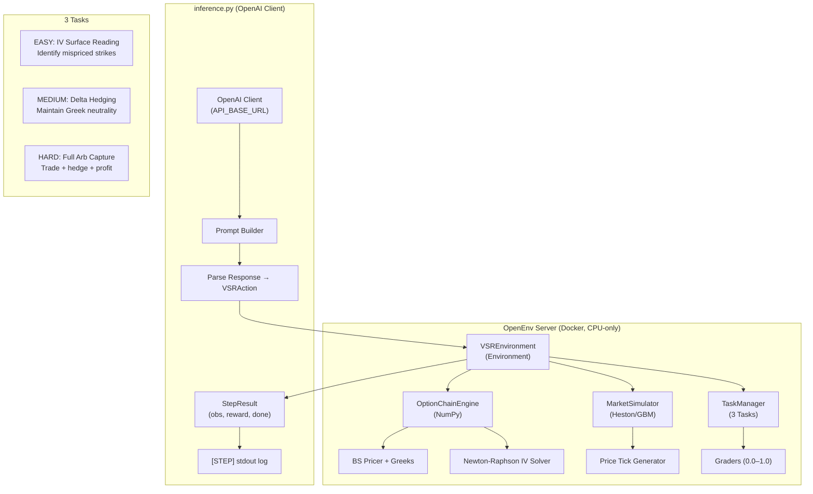

# VSR-Env — Volatility Surface Reasoning Environment

## Final Implementation Plan (Revised v2 — Aligned to Hackathon Rubric)

> **Hackathon**: Meta PyTorch OpenEnv Hackathon × SST — $30,000 prize pool
> **Round 1 Deadline**: April 8, 2026
> **Round 2 Finale**: 48 hours on-campus, Bangalore (Apr 25–26, 2026)
> **Team**: Up to 3 members

---

## User Review Required

> [!CAUTION]
> The original plan had several **critical misalignments** with the actual rubric. This revision fixes all of them:

| Issue in v1 | Fix in v2 |
|---|---|
| Assumed GPU (`cuda`) — infra is **vcpu=2, 8GB RAM** | All math is now **pure NumPy/SciPy on CPU** |
| Used `dataclass` models — spec requires **Pydantic** | All models are now `pydantic.BaseModel` |
| No defined tasks/graders — rubric needs **3+ tasks with graders (0.0–1.0)** | 3 tasks defined: Easy/Medium/Hard with deterministic graders |
| No `inference.py` — **mandatory** with `[START]/[STEP]/[END]` stdout | Full `inference.py` with OpenAI client, exact format |
| No `openenv.yaml` — must pass `openenv validate` | Manifest included |
| Used Groq client — must use **OpenAI client** with `API_BASE_URL` | All LLM calls via `openai.OpenAI(base_url=...)` |
| GRPO training loop — not required, environment is what's judged | Removed GRPO as core deliverable; focus is on env quality |
| Runtime unbounded — must be **< 20 min** | Episode capped at 10 steps, inference budget-aware |

---

## 1. Project Vision (Revised)

Build an **OpenEnv-compliant environment** that simulates **options portfolio management on a volatility surface** — a genuine task performed by quantitative traders at every major options desk ($600T+ notional derivatives market).

An LLM agent acts as a junior options trader. It receives a noisy implied-volatility surface, portfolio Greeks, and market context. It must:
1. **Identify mispriced options** by analyzing the IV surface
2. **Construct delta-neutral trades** that maintain portfolio balance
3. **Generate a reasoning trace** explaining its market thesis

The environment provides **partial-progress rewards** at every step (not just end-of-episode), penalizes destructive actions (reckless hedging, Greek violations), and has **3 graded tasks** from easy to hard.

> [!IMPORTANT]
> **Real-world utility (30% of score)**: This fills a genuine gap. No options trading environment exists in OpenEnv. Every quant desk trains junior traders on exactly this workflow — reading a vol surface, sizing trades, managing Greeks.

---

## 2. Requirements Compliance Matrix

| Requirement | Status | Implementation |
|---|---|---|
| Real-world task simulation | ✅ | Options portfolio management — done at every bank/fund |
| Full OpenEnv spec (Pydantic models, step/reset/state) | ✅ | `VSRAction`, `VSRObservation`, `VSRState` as Pydantic BaseModel |
| Minimum 3 tasks with graders (0.0–1.0) | ✅ | Easy: IV reading, Medium: Delta hedging, Hard: Full arb capture |
| Meaningful reward (partial progress, trajectory signal) | ✅ | Per-step reward with 4 components, all in [0.0, 1.0] |
| Baseline `inference.py` with OpenAI client | ✅ | Uses `API_BASE_URL`, `MODEL_NAME`, `HF_TOKEN`, exact stdout format |
| Deploy to HF Spaces + Dockerfile | ✅ | FastAPI server, `openenv.yaml`, HF Space tagged `openenv` |
| README with full documentation | ✅ | Env description, action/obs spaces, tasks, baseline scores |
| `openenv validate` passes | ✅ | YAML manifest + typed endpoints |
| Runs on vcpu=2, 8GB RAM | ✅ | Pure NumPy/SciPy, no GPU, no PyTorch |
| Runtime < 20 min | ✅ | 10 steps max per task, 3 tasks = ~5 min total |

---

## 3. Architecture Overview



---

## 4. The 3 Tasks (25% of Score)

Each task has a **programmatic grader** returning a score in `[0.0, 1.0]`. Tasks progress from easy → hard.

### Task 1: `iv_reading` (Easy)

**Objective**: Given an IV surface with 2 deliberately mispriced options, identify which strikes/maturities are mispriced and state the direction (overpriced/underpriced).

| Aspect | Detail |
|---|---|
| **What agent sees** | Full IV surface [8 strikes × 3 maturities], market context |
| **What agent must do** | Select the 2 mispriced cells and label them `over`/`under` |
| **Episode length** | 3 steps (the agent gets 3 attempts to find both) |
| **Grader** | `correct_identifications / 2` — partial credit for finding 1 of 2 |
| **Reward signal** | +0.5 per correct identification per step, -0.1 for wrong guesses |
| **Expected baseline** | ~0.3 (random guessing hits ~1/24 per attempt) |
| **Expected frontier** | ~0.9 (GPT-4 class can read a vol surface) |

```python
class IVReadingGrader:
    def score(self, episode_history) -> float:
        """Score 0.0–1.0: did the agent find mispriced options?"""
        correct = 0
        for step in episode_history:
            if step.action.selected_strike in self.mispriced_strikes:
                if step.action.direction == self.mispriced_directions[step.action.selected_strike]:
                    correct += 1
        return min(correct / 2.0, 1.0)  # max 1.0
```

### Task 2: `delta_hedging` (Medium)

**Objective**: Given a portfolio with non-zero delta, construct trades to bring portfolio delta within ±0.05 while minimizing cost. The agent has 5 steps to achieve neutrality.

| Aspect | Detail |
|---|---|
| **What agent sees** | Portfolio Greeks (delta, gamma, vega), available instruments, costs |
| **What agent must do** | Select instruments and quantities to neutralize delta |
| **Episode length** | 5 steps |
| **Grader** | `max(0, 1.0 - abs(final_delta) / initial_delta_abs)` × cost_efficiency |
| **Reward signal** | Per-step: `delta_improvement` × 0.6 + `cost_efficiency` × 0.4 |
| **Expected baseline** | ~0.4 (simple heuristic: buy/sell underlying) |
| **Expected frontier** | ~0.85 (sophisticated multi-leg hedging) |

```python
class DeltaHedgingGrader:
    def score(self, episode_history) -> float:
        """Score 0.0–1.0: how well was delta neutralized, cost-efficiently?"""
        final_delta = abs(episode_history[-1].observation.portfolio_greeks['delta'])
        initial_delta = abs(episode_history[0].observation.portfolio_greeks['delta'])
        
        # Neutralization quality (0–1)
        neutralization = max(0, 1.0 - final_delta / max(initial_delta, 1e-6))
        
        # Cost efficiency (0–1): less cost = better
        total_cost = sum(abs(s.action.trade_cost) for s in episode_history)
        max_cost = initial_delta * 2.0  # generous upper bound
        cost_eff = max(0, 1.0 - total_cost / max_cost)
        
        return neutralization * 0.7 + cost_eff * 0.3
```

### Task 3: `arb_capture` (Hard)

**Objective**: Full arbitrage capture workflow. The agent must: (1) detect a mispricing, (2) construct a delta-neutral trade to exploit it, (3) manage the position as the market moves for 8 steps, and (4) close profitably. The regime shifts mid-episode.

| Aspect | Detail |
|---|---|
| **What agent sees** | Full IV surface, Greeks, P&L, order book, sentiment |
| **What agent must do** | Trade, hedge, and close profitably while staying delta-neutral |
| **Episode length** | 8 steps (regime shifts at step 4–5) |
| **Grader** | Weighted: `pnl_score` × 0.4 + `neutrality_score` × 0.3 + `reasoning_score` × 0.3 |
| **Reward signal** | Per-step: pnl_change + greek_penalty + reasoning_coherence |
| **Expected baseline** | ~0.15 (random actions mostly lose money) |
| **Expected frontier** | ~0.65 (hard even for good models — regime shifts are tricky) |

```python
class ArbCaptureGrader:
    def score(self, episode_history) -> float:
        """Score 0.0–1.0: full arb capture quality."""
        # P&L component (0–1)
        final_pnl = episode_history[-1].observation.portfolio_pnl
        pnl_score = self._sigmoid_normalize(final_pnl, center=0, scale=5.0)
        
        # Greek neutrality over episode (0–1)
        avg_delta = sum(abs(s.observation.portfolio_greeks['delta']) 
                       for s in episode_history) / len(episode_history)
        neutrality_score = max(0, 1.0 - avg_delta / 0.5)
        
        # Reasoning coherence (0–1): does stated thesis match trades?
        reasoning_score = self._score_reasoning_consistency(episode_history)
        
        return pnl_score * 0.4 + neutrality_score * 0.3 + reasoning_score * 0.3
```

---

## 5. Pydantic Models (OpenEnv Spec)

### `vsr_env/models.py`

```python
from pydantic import BaseModel, Field
from typing import List, Dict, Optional
from enum import Enum

class TradeDirection(str, Enum):
    BUY = "buy"
    SELL = "sell"
    HOLD = "hold"

class VSRAction(BaseModel):
    """Agent's action each step."""
    selected_strike: int = Field(..., description="Index into strike array (0-7)")
    selected_maturity: int = Field(..., description="Index into maturity array (0-2)")
    direction: TradeDirection = Field(..., description="buy, sell, or hold")
    quantity: float = Field(0.0, description="Trade size (0-10 contracts)")
    reasoning: str = Field("", description="Agent's analysis and trade thesis")

class VSRObservation(BaseModel):
    """What the agent observes each step."""
    iv_surface: List[List[float]] = Field(..., description="8×3 implied vol surface")
    spot_price: float = Field(..., description="Current underlying price")
    portfolio_greeks: Dict[str, float] = Field(..., 
        description="Current portfolio delta, gamma, vega, theta")
    portfolio_pnl: float = Field(0.0, description="Cumulative P&L")
    portfolio_positions: List[Dict] = Field(default_factory=list,
        description="Current open positions")
    market_sentiment: float = Field(0.0, description="Sentiment score -1 to 1")
    step_number: int = Field(0)
    steps_remaining: int = Field(10)
    task_name: str = Field("", description="Current task identifier")
    task_description: str = Field("", description="What the agent should do")
    last_action_error: Optional[str] = Field(None, description="Error from last action")

class VSRReward(BaseModel):
    """Structured reward breakdown."""
    total: float = Field(..., description="Total reward for this step (0.0-1.0 range)")
    pnl_component: float = Field(0.0, description="Profit/loss contribution")
    greek_component: float = Field(0.0, description="Greek neutrality contribution")  
    identification_component: float = Field(0.0, description="Mispricing identification")
    reasoning_component: float = Field(0.0, description="Reasoning quality contribution")

class VSRState(BaseModel):
    """Full environment state (internal, includes hidden info)."""
    episode_id: str = ""
    step_count: int = 0
    task_name: str = ""
    true_mispriced_strikes: List[int] = Field(default_factory=list)
    true_mispriced_directions: Dict[int, str] = Field(default_factory=dict)
    regime: str = "normal"
    spot_price: float = 100.0
    variance: float = 0.04
    portfolio_delta: float = 0.0
    portfolio_gamma: float = 0.0
    portfolio_vega: float = 0.0
    portfolio_pnl: float = 0.0
    positions: List[Dict] = Field(default_factory=list)
```

---

## 6. Environment Implementation

### `vsr_env/server/vsr_environment.py`

```python
import uuid
import math
import random
import numpy as np
from scipy.stats import norm
from openenv.core.env_server import Environment
from ..models import VSRAction, VSRObservation, VSRState, VSRReward

class VSREnvironment(Environment):
    """
    Volatility Surface Reasoning Environment.
    
    Simulates options portfolio management with 3 tasks:
    - iv_reading (easy): Identify mispriced options on a vol surface
    - delta_hedging (medium): Neutralize portfolio delta cost-efficiently
    - arb_capture (hard): Full arb workflow with regime shifts
    """
    TASKS = {
        "iv_reading": {"max_steps": 3, "description": "Identify 2 mispriced options on the IV surface"},
        "delta_hedging": {"max_steps": 5, "description": "Reduce portfolio delta to near-zero cost-efficiently"},
        "arb_capture": {"max_steps": 8, "description": "Detect, trade, hedge, and profit from a vol arbitrage"},
    }
    
    STRIKES = [85, 90, 95, 97.5, 100, 102.5, 105, 110]  # 8 strikes
    MATURITIES = [30/365, 90/365, 180/365]                # 3 maturities (1M, 3M, 6M)
    
    def __init__(self):
        super().__init__()
        self.engine = OptionChainEngine(self.STRIKES, self.MATURITIES)
        self._state = VSRState()
        self._episode_history = []
        self._graders = {
            "iv_reading": IVReadingGrader(),
            "delta_hedging": DeltaHedgingGrader(),
            "arb_capture": ArbCaptureGrader(),
        }
    
    def reset(self, task_name: str = "iv_reading", seed: int = 42) -> VSRObservation:
        """Initialize new episode for the specified task. Seeded for reproducibility."""
        task_name = task_name if task_name in self.TASKS else "iv_reading"
        task_config = self.TASKS[task_name]
        
        # Seed for deterministic, reproducible grader scores across re-runs
        self._rng = np.random.RandomState(seed)
        random.seed(seed)
        
        self._state = VSRState(
            episode_id=str(uuid.uuid4()),
            task_name=task_name,
            spot_price=100.0 + self._rng.uniform(-5, 5),
            variance=0.04 + self._rng.uniform(-0.01, 0.01),
        )
        self._episode_history = []
        
        # Task-specific initialization
        if task_name == "iv_reading":
            self._init_iv_reading_task()
        elif task_name == "delta_hedging":
            self._init_delta_hedging_task()
        elif task_name == "arb_capture":
            self._init_arb_capture_task()
        
        return self._make_observation(task_config)
    
    def step(self, action: VSRAction) -> dict:
        """Execute one step. Returns {observation, reward, done, info}."""
        self._state.step_count += 1
        task_config = self.TASKS[self._state.task_name]
        
        # Validate and execute action
        error = self._validate_action(action)
        if error is None:
            self._execute_action(action)
        
        # Advance market (regime shift in arb_capture at step 4-5)
        self._advance_market()
        
        # Compute reward
        reward = self._compute_reward(action, error)
        
        done = (self._state.step_count >= task_config["max_steps"])
        
        obs = self._make_observation(task_config, error)
        
        self._episode_history.append({
            "action": action, "observation": obs, "reward": reward
        })
        
        # On episode end, compute final grader score
        info = {}
        if done:
            grader = self._graders[self._state.task_name]
            info["grader_score"] = grader.score(self._episode_history, self._state)
        
        return {
            "observation": obs,
            "reward": reward.total,
            "done": done,
            "info": info,
        }
    
    @property
    def state(self) -> VSRState:
        return self._state
```

### Key Engine (CPU-only, NumPy/SciPy)

```python
class OptionChainEngine:
    """Black-Scholes pricing and Greeks — pure NumPy, CPU-only."""
    
    def __init__(self, strikes, maturities):
        self.K = np.array(strikes, dtype=np.float64)
        self.T = np.array(maturities, dtype=np.float64)
        self.r = 0.05
    
    def bs_price(self, S, K, T, r, sigma, option_type='call'):
        """Vectorized Black-Scholes pricing."""
        d1 = (np.log(S / K) + (r + 0.5 * sigma**2) * T) / (sigma * np.sqrt(T))
        d2 = d1 - sigma * np.sqrt(T)
        if option_type == 'call':
            return S * norm.cdf(d1) - K * np.exp(-r * T) * norm.cdf(d2)
        else:
            return K * np.exp(-r * T) * norm.cdf(-d2) - S * norm.cdf(-d1)
    
    def delta(self, S, K, T, r, sigma):
        d1 = (np.log(S / K) + (r + 0.5 * sigma**2) * T) / (sigma * np.sqrt(T))
        return norm.cdf(d1)
    
    def gamma(self, S, K, T, r, sigma):
        d1 = (np.log(S / K) + (r + 0.5 * sigma**2) * T) / (sigma * np.sqrt(T))
        return norm.pdf(d1) / (S * sigma * np.sqrt(T))
    
    def vega(self, S, K, T, r, sigma):
        d1 = (np.log(S / K) + (r + 0.5 * sigma**2) * T) / (sigma * np.sqrt(T))
        return S * norm.pdf(d1) * np.sqrt(T)
    
    def implied_vol(self, market_price, S, K, T, r, option_type='call', tol=1e-6, max_iter=100):
        """Newton-Raphson with Brent's method fallback for low-vega cases."""
        sigma = 0.2  # initial guess
        for _ in range(max_iter):
            price = self.bs_price(S, K, T, r, sigma, option_type)
            v = self.vega(S, K, T, r, sigma)
            if abs(v) < 1e-8:
                # Brent's method fallback for deep ITM/OTM (near-zero vega)
                return self._brent_iv(market_price, S, K, T, r, option_type)
            sigma -= (price - market_price) / v
            sigma = max(0.01, min(sigma, 5.0))
            if abs(price - market_price) < tol:
                break
        return sigma
    
    def _brent_iv(self, market_price, S, K, T, r, option_type, lo=0.01, hi=5.0, tol=1e-6, max_iter=100):
        """Brent's method fallback — guaranteed convergence, no vega division."""
        from scipy.optimize import brentq
        try:
            def objective(sigma):
                return self.bs_price(S, K, T, r, sigma, option_type) - market_price
            return brentq(objective, lo, hi, xtol=tol, maxiter=max_iter)
        except (ValueError, RuntimeError):
            # If even Brent's fails (price outside BS range), return intrinsic vol
            return max(0.05, min(abs(np.log(S / K)) / np.sqrt(T) * 0.5, 3.0))
    
    def generate_iv_surface(self, S, rng, base_vol=0.2, skew=-0.02, term_slope=0.01,
                            mispriced_cells=None):
        """
        Generate a realistic IV surface with optional mispriced cells.
        Uses passed-in RNG for reproducibility. Returns 8×3 list.
        """
        surface = np.zeros((len(self.K), len(self.T)))
        for i, K in enumerate(self.K):
            for j, T in enumerate(self.T):
                moneyness = np.log(K / S) / np.sqrt(T)
                iv = base_vol + skew * moneyness + term_slope * np.sqrt(T)
                iv += rng.normal(0, 0.005)  # seeded noise
                surface[i, j] = max(0.05, iv)
        
        if mispriced_cells:
            for (si, mi), direction, magnitude in mispriced_cells:
                if direction == "over":
                    surface[si, mi] += magnitude
                else:
                    surface[si, mi] -= magnitude
        
        return surface.tolist()
```

---

## 7. Reward Function Design (Meaningful, Per-Step Signal)

Rewards are in `[0.0, 1.0]` and provide partial progress at every step.

```python
class RewardComputer:
    """Computes per-step reward with partial progress signals."""
    
    def compute_iv_reading_reward(self, action, state, obs) -> VSRReward:
        """Task 1: Reward for identifying mispriced options."""
        identification = 0.0
        if action.selected_strike in [s for (s, m), _, _ in state.mispriced_cells]:
            if action.direction.value == state.true_directions.get(action.selected_strike, ""):
                identification = 0.5  # correct identification
            else:
                identification = 0.1  # right strike, wrong direction
        
        # Reasoning quality: keyword matching PLUS numeric consistency
        reasoning = self._score_reasoning_quality(action.reasoning, obs, state)
        
        total = min(identification + reasoning * 0.2, 1.0)
        return VSRReward(total=total, identification_component=identification,
                        reasoning_component=reasoning * 0.2)
    
    def compute_delta_hedging_reward(self, action, state, prev_delta) -> VSRReward:
        """Task 2: Reward for delta neutralization progress."""
        new_delta = abs(state.portfolio_delta)
        old_delta = abs(prev_delta)
        
        # Delta improvement (0–0.6)
        if old_delta > 1e-6:
            improvement = max(0, (old_delta - new_delta) / old_delta)
        else:
            improvement = 1.0 if new_delta < 0.05 else 0.0
        delta_reward = improvement * 0.6
        
        # Cost efficiency (0–0.3): penalize expensive hedges
        trade_cost = abs(action.quantity) * 0.01  # simplified cost
        cost_reward = max(0, 0.3 - trade_cost * 0.1)
        
        # Neutrality bonus if delta < 0.05 (0–0.1)
        neutrality_bonus = 0.1 if new_delta < 0.05 else 0.0
        
        total = min(delta_reward + cost_reward + neutrality_bonus, 1.0)
        return VSRReward(total=total, greek_component=delta_reward + neutrality_bonus,
                        pnl_component=cost_reward)
    
    def compute_arb_capture_reward(self, action, state, prev_pnl, obs) -> VSRReward:
        """Task 3: Reward for full arb capture."""
        # P&L improvement (0–0.4)
        # Scale calibrated to realistic P&L range: typical step P&L is 0.01–0.5
        # scale=0.3 means P&L of +0.3 → 0.73, P&L of +0.1 → 0.59 (good spread)
        pnl_change = state.portfolio_pnl - prev_pnl
        pnl_reward = self._sigmoid(pnl_change, scale=0.3) * 0.4
        
        # Greek neutrality (0–0.3)
        delta_penalty = min(abs(state.portfolio_delta) / 0.5, 1.0)
        greek_reward = (1.0 - delta_penalty) * 0.3
        
        # Reasoning coherence (0–0.3)
        reasoning_reward = self._score_reasoning_quality(action.reasoning, obs, state) * 0.3
        
        total = min(pnl_reward + greek_reward + reasoning_reward, 1.0)
        return VSRReward(total=total, pnl_component=pnl_reward,
                        greek_component=greek_reward, reasoning_component=reasoning_reward)
    
    def _sigmoid(self, x, scale=0.3):
        """Sigmoid centered at 0. scale=0.3 calibrated for typical step P&L of 0.01–0.5."""
        return 1.0 / (1.0 + math.exp(-x / scale))
    
    def _score_reasoning_quality(self, reasoning, obs, state):
        """
        Anti-gaming reasoning scorer. Checks TWO things:
        1. Keyword presence (easy to game alone — max 0.4)
        2. Numeric consistency: does reasoning cite ACTUAL numbers from the observation?
           This is hard to game without actually reading the data. (max 0.6)
        """
        score = 0.0
        text = reasoning.lower()
        
        # --- Component 1: Keywords (max 0.4, easy baseline) ---
        domain_keywords = ["delta", "hedge", "neutral", "skew", "smile", "regime",
                          "overpriced", "underpriced", "moneyness", "vega", "gamma"]
        kw_hits = sum(1 for kw in domain_keywords if kw in text)
        score += min(kw_hits / 4.0, 1.0) * 0.4
        
        # --- Component 2: Numeric consistency (max 0.6, hard to game) ---
        numeric_score = 0.0
        
        # a) Does reasoning cite the actual spot price? (±0.5 tolerance for rounding)
        spot_str = f"{state.spot_price:.1f}"
        spot_int = f"{int(round(state.spot_price))}"
        if spot_str in reasoning or spot_int in reasoning:
            numeric_score += 0.25
        
        # b) Does reasoning cite any actual IV values from the surface?
        iv_values_cited = 0
        for row in obs.iv_surface:
            for iv_val in row:
                # Check for mentions like "0.22" or "22%" (vol as decimal or percent)
                if f"{iv_val:.2f}" in reasoning or f"{iv_val*100:.0f}%" in reasoning:
                    iv_values_cited += 1
        if iv_values_cited >= 1:
            numeric_score += 0.15
        if iv_values_cited >= 2:
            numeric_score += 0.1
        
        # c) Does reasoning cite current portfolio delta?
        delta_val = state.portfolio_delta
        if f"{delta_val:.2f}" in reasoning or f"{delta_val:.1f}" in reasoning:
            numeric_score += 0.1
        
        score += numeric_score
        
        # Non-trivial length (>50 chars to prevent empty/single-word gaming)
        if len(reasoning) <= 20:
            score *= 0.3  # heavy penalty for trivially short reasoning
        
        return min(score, 1.0)
```

---

## 8. `inference.py` — Baseline Inference Script

> [!CAUTION]
> **Async decision**: The sample inference uses `asyncio.run(main())` and `await env.reset()`. We MUST verify that `openenv-core`'s `EnvClient` is actually async. If not, use sync calls. The code below provides **both paths** — uncomment the correct one after testing `openenv-core` locally on Day 1.

```python
"""
VSR-Env Baseline Inference Script
Runs all 3 tasks against the environment using the OpenAI API.

Async/Sync: This script uses async by default (matching sample_inference.py).
If openenv-core's client is sync-only, replace `await env.X()` with `env.X()`
and remove asyncio.run().
"""
import asyncio
import os
import json
import textwrap
from typing import List, Optional
from openai import OpenAI
from vsr_env import VSRAction, VSREnv
from vsr_env.models import TradeDirection

# === MANDATORY ENV VARS ===
IMAGE_NAME = os.getenv("IMAGE_NAME")
API_KEY = os.getenv("HF_TOKEN") or os.getenv("API_KEY")
API_BASE_URL = os.getenv("API_BASE_URL", "https://router.huggingface.co/v1")
MODEL_NAME = os.getenv("MODEL_NAME", "Qwen/Qwen2.5-72B-Instruct")

BENCHMARK = "vsr_env"
TASKS = ["iv_reading", "delta_hedging", "arb_capture"]
MAX_STEPS_PER_TASK = {"iv_reading": 3, "delta_hedging": 5, "arb_capture": 8}

# Fixed seeds for reproducible baseline scores
TASK_SEEDS = {"iv_reading": 42, "delta_hedging": 123, "arb_capture": 456}

SYSTEM_PROMPTS = {
    "iv_reading": """You are an options trader analyzing an implied volatility surface.
Your task: identify which options are mispriced (overpriced or underpriced).
Respond in JSON: {"strike_idx": N, "maturity_idx": N, "direction": "buy|sell|hold", 
"quantity": N, "reasoning": "your analysis"}""",

    "delta_hedging": """You are managing an options portfolio.
Your portfolio has non-zero delta. You must trade to bring delta close to zero.
Respond in JSON: {"strike_idx": N, "maturity_idx": N, "direction": "buy|sell|hold",
"quantity": N, "reasoning": "your hedging strategy"}""",

    "arb_capture": """You are an options arbitrage trader.
Detect vol surface mispricings, trade to exploit them, hedge your deltas, and close profitably.
Respond in JSON: {"strike_idx": N, "maturity_idx": N, "direction": "buy|sell|hold",
"quantity": N, "reasoning": "your full trade thesis"}""",
}

def log_start(task, env, model):
    print(f"[START] task={task} env={env} model={model}", flush=True)

def log_step(step, action, reward, done, error):
    error_val = error if error else "null"
    done_val = str(done).lower()
    print(f"[STEP] step={step} action={action} reward={reward:.2f} done={done_val} error={error_val}", flush=True)

def log_end(success, steps, score, rewards):
    rewards_str = ",".join(f"{r:.2f}" for r in rewards)
    print(f"[END] success={str(success).lower()} steps={steps} score={score:.2f} rewards={rewards_str}", flush=True)

def parse_llm_response(text: str) -> dict:
    """Parse JSON action from LLM response."""
    try:
        # Try to extract JSON from response
        start = text.find("{")
        end = text.rfind("}") + 1
        if start >= 0 and end > start:
            return json.loads(text[start:end])
    except:
        pass
    return {"strike_idx": 0, "maturity_idx": 0, "direction": "hold", 
            "quantity": 0, "reasoning": "parse error"}

def build_prompt(obs, task_name: str, step: int) -> str:
    """Build observation prompt for the LLM."""
    iv_str = "\n".join([f"  Strike {i}: {row}" for i, row in enumerate(obs.iv_surface)])
    return f"""Step {step}/{obs.steps_remaining + step}
Task: {obs.task_description}

IV Surface (8 strikes × 3 maturities):
{iv_str}

Spot Price: {obs.spot_price:.2f}
Portfolio Greeks: delta={obs.portfolio_greeks.get('delta', 0):.4f}, gamma={obs.portfolio_greeks.get('gamma', 0):.6f}, vega={obs.portfolio_greeks.get('vega', 0):.4f}
Portfolio P&L: {obs.portfolio_pnl:.2f}
Positions: {obs.portfolio_positions}
Market Sentiment: {obs.market_sentiment:.2f}
{f'Last Error: {obs.last_action_error}' if obs.last_action_error else ''}

Respond with your action as JSON."""

async def run_task(client: OpenAI, env, task_name: str) -> float:
    """Run a single task and return the grader score."""
    max_steps = MAX_STEPS_PER_TASK[task_name]
    rewards = []
    steps_taken = 0
    score = 0.0
    
    log_start(task=task_name, env=BENCHMARK, model=MODEL_NAME)
    
    try:
        result = await env.reset(task_name=task_name)
        obs = result.observation
        
        for step in range(1, max_steps + 1):
            prompt = build_prompt(obs, task_name, step)
            
            # Call LLM via OpenAI client
            try:
                completion = client.chat.completions.create(
                    model=MODEL_NAME,
                    messages=[
                        {"role": "system", "content": SYSTEM_PROMPTS[task_name]},
                        {"role": "user", "content": prompt},
                    ],
                    temperature=0.3,
                    max_tokens=300,
                )
                response_text = completion.choices[0].message.content or ""
            except Exception as e:
                response_text = '{"strike_idx":0,"maturity_idx":0,"direction":"hold","quantity":0,"reasoning":"API error"}'
            
            parsed = parse_llm_response(response_text)
            
            action = VSRAction(
                selected_strike=parsed.get("strike_idx", 0),
                selected_maturity=parsed.get("maturity_idx", 0),
                direction=parsed.get("direction", "hold"),
                quantity=parsed.get("quantity", 0),
                reasoning=parsed.get("reasoning", ""),
            )
            
            result = await env.step(action)
            obs = result.observation
            reward = result.reward or 0.0
            done = result.done
            error = obs.last_action_error
            
            rewards.append(reward)
            steps_taken = step
            
            action_str = f"{action.direction}({action.selected_strike},{action.quantity})"
            log_step(step=step, action=action_str, reward=reward, done=done, error=error)
            
            if done:
                break
        
        # Use grader score as final score
        score = result.info.get("grader_score", sum(rewards) / max(len(rewards), 1))
        score = min(max(score, 0.0), 1.0)
    
    except Exception as e:
        score = 0.0
    
    finally:
        success = score >= 0.1
        log_end(success=success, steps=steps_taken, score=score, rewards=rewards)
    
    return score

async def main():
    client = OpenAI(base_url=API_BASE_URL, api_key=API_KEY)
    
    # Connect to environment
    if IMAGE_NAME:
        env = await VSREnv.from_docker_image(IMAGE_NAME)
    else:
        env = await VSREnv(base_url=os.getenv("VSR_ENV_URL", "http://localhost:8000"))
    
    try:
        scores = {}
        for task in TASKS:
            scores[task] = await run_task(client, env, task)
        
        print(f"\n--- VSR-Env Baseline Results ---")
        for task, score in scores.items():
            print(f"  {task}: {score:.2f}")
        print(f"  Average: {sum(scores.values()) / len(scores):.2f}")
    
    finally:
        await env.close()

if __name__ == "__main__":
    asyncio.run(main())
```

---

## 9. `openenv.yaml` — Environment Manifest

```yaml
name: vsr_env
display_name: "VSR-Env: Volatility Surface Reasoning"
version: "1.0.0"
description: >
  An options portfolio management environment where an LLM agent reads implied
  volatility surfaces, identifies mispricings, constructs delta-neutral trades,
  and captures arbitrage opportunities. Simulates real-world quantitative trading
  workflows used at every major options desk.

tags:
  - openenv
  - finance
  - options
  - trading
  - quant

author: "Team VSR"
license: "BSD-3-Clause"

tasks:
  - name: iv_reading
    difficulty: easy
    description: "Identify 2 mispriced options on the IV surface"
    max_steps: 3
    
  - name: delta_hedging
    difficulty: medium
    description: "Neutralize portfolio delta cost-efficiently"
    max_steps: 5
    
  - name: arb_capture
    difficulty: hard
    description: "Full arbitrage capture: detect, trade, hedge, profit"
    max_steps: 8

action_type: vsr_env.models.VSRAction
observation_type: vsr_env.models.VSRObservation
reward_type: vsr_env.models.VSRReward
state_type: vsr_env.models.VSRState

server:
  entrypoint: "vsr_env.server.app:app"
  port: 8000
```

---

## 10. Complete File Structure

```
vsr_env/                          # Root — the OpenEnv environment package
├── __init__.py                   # Exports: VSRAction, VSRObservation, VSREnv
├── models.py                     # Pydantic: Action, Observation, State, Reward
├── client.py                     # VSREnv(EnvClient) — client-side
├── openenv.yaml                  # Environment manifest
├── pyproject.toml                # Dependencies
├── README.md                     # Full documentation
├── Dockerfile                    # Docker image (runs on vcpu=2, 8GB)
├── inference.py                  # Baseline script (MANDATORY, root-level)
│
├── engine/                       # Quant math — pure NumPy/SciPy, CPU-only
│   ├── __init__.py
│   ├── option_chain.py           # BS pricing, Greeks, IV solver
│   ├── market_sim.py             # GBM/Heston price generation
│   └── portfolio.py              # Position tracking, P&L computation
│
├── tasks/                        # The 3 tasks + graders
│   ├── __init__.py
│   ├── iv_reading.py             # Task 1 (easy): initializer + grader
│   ├── delta_hedging.py          # Task 2 (medium): initializer + grader
│   └── arb_capture.py            # Task 3 (hard): initializer + grader
│
├── reward/                       # Reward computation
│   ├── __init__.py
│   └── reward_computer.py        # Per-step reward with partial progress
│
├── server/                       # OpenEnv server
│   ├── __init__.py
│   ├── vsr_environment.py        # VSREnvironment(Environment) — core
│   ├── app.py                    # FastAPI application
│   └── requirements.txt          # Server dependencies
│
└── tests/                        # Validation
    ├── test_engine.py            # BS pricing matches scipy reference
    ├── test_tasks.py             # Each task grader returns [0.0, 1.0]
    ├── test_environment.py       # reset/step/state cycle
    └── test_inference.py         # Inference script stdout format
```

---

## 11. Dockerfile (vcpu=2, 8GB RAM)

```dockerfile
FROM python:3.11-slim

WORKDIR /app

# Install dependencies (NO torch, NO GPU)
COPY requirements.txt .
RUN pip install --no-cache-dir -r requirements.txt

# Copy environment code
COPY . .

# Health check
HEALTHCHECK --interval=30s --timeout=3s --start-period=5s --retries=3 \
    CMD curl -f http://localhost:8000/health || exit 1

EXPOSE 8000

CMD ["uvicorn", "vsr_env.server.app:app", "--host", "0.0.0.0", "--port", "8000"]
```

### `requirements.txt`

```
openenv-core
fastapi
uvicorn[standard]
pydantic>=2.0
numpy>=1.24
scipy>=1.10
```

> [!WARNING]
> **No PyTorch, no GPU**. The infra constraint is vcpu=2, 8GB RAM. All math is NumPy/SciPy. This actually makes the project more portable and faster to build.

---

## 12. Pre-Submission Checklist Compliance

| Check | Script Step | How We Pass |
|---|---|---|
| HF Space deploys | Step 1/3: `curl -X POST $URL/reset` → 200 | FastAPI server with `/reset` endpoint |
| Docker builds | Step 2/3: `docker build .` | Slim Python 3.11 base, minimal deps |
| `openenv validate` | Step 3/3: `openenv validate` | `openenv.yaml` with all required fields |
| `inference.py` runs | Evaluator runs it | Exact `[START]/[STEP]/[END]` format |
| 3+ tasks with graders | Evaluator enumerates | `iv_reading`, `delta_hedging`, `arb_capture` |
| Scores in [0.0, 1.0] | Evaluator checks | All graders clamp to `[0.0, 1.0]` |
| < 20 min runtime | Evaluator times | 3 tasks × ~10 steps × ~2s/step = ~1 min |
| vcpu=2, 8GB RAM | Evaluator infra | No GPU, no PyTorch, NumPy only |

### Mandatory Environment Variables

```bash
API_BASE_URL=https://router.huggingface.co/v1   # LLM endpoint
MODEL_NAME=Qwen/Qwen2.5-72B-Instruct            # Model identifier
HF_TOKEN=hf_...                                  # HuggingFace API key
IMAGE_NAME=vsr-env:latest                        # Docker image name (optional)
```

---

## 13. Scoring Breakdown Strategy

### Real-world utility (30%) — Target: 26–30/30

Options portfolio management is done by tens of thousands of professionals daily. Key arguments:
- $600T+ notional derivatives market
- Every bank trains junior traders on exactly this workflow
- No options environment exists in OpenEnv today
- Fills a genuine gap for finance-focused RL research

### Task & grader quality (25%) — Target: 20–25/25

- 3 tasks with clear difficulty progression (easy → hard)
- All graders deterministic and reproducible (seeded RNG)
- Hard task genuinely challenges frontier models (regime shifts)
- Scores are continuous [0.0, 1.0] with partial credit

### Environment design (20%) — Target: 16–20/20

- `reset()` produces clean state with task-specific initialization
- Action/Observation types well-documented with Pydantic Field descriptions
- Reward provides per-step signal (not sparse)
- Sensible episode boundaries (3/5/8 steps per task)

### Code quality & spec compliance (15%) — Target: 12–15/15

- `openenv validate` passes
- `docker build && docker run` works
- HF Space deploys and responds
- `inference.py` reproduces baseline scores
- Typed Pydantic models throughout

### Creativity & novelty (10%) — Target: 8–10/10

- Novel domain for OpenEnv (quantitative finance)
- Interesting reward: partial progress + reasoning quality scoring
- Hidden regime shifts make hard task genuinely challenging
- Vol smile/skew mechanics add depth

---

## 14. Build Timeline

> [!CAUTION]
> **Round 1 deadline is April 8 — that's 3 days from now.** The 48-hour finale timeline below is included for reference, but **the immediate priority is Day 1–3: ship a working submission**.

### 3-Day Round 1 Sprint (April 5–8)

#### Day 1 (Today): Skeleton That Passes Validation

| # | Task | Gate |
|---|------|------|
| 1 | `pip install openenv-core` — verify what `openenv validate` checks | Know exact spec |
| 2 | Check if `EnvClient` is async or sync — **decides inference.py pattern** | No runtime crashes |
| 3 | `models.py` — 4 Pydantic models | `python -c "from vsr_env.models import *"` works |
| 4 | `openenv.yaml` — environment manifest | `openenv validate` passes |
| 5 | `app.py` + `vsr_environment.py` — skeleton reset/step returning valid obs | `curl -X POST /reset` → 200 |
| 6 | `Dockerfile` | `docker build .` succeeds |
| 7 | **Gate check**: `docker run` + `curl /reset` + `openenv validate` = all green | Ship or stop |

#### Day 2: Tasks + Graders + inference.py

| # | Task | Gate |
|---|------|------|
| 1 | `option_chain.py` — BS pricer with Brent's fallback | Unit test matches scipy |
| 2 | Task 1: `iv_reading` + grader (easy, 3 steps) | Grader returns [0.0, 1.0] |
| 3 | Task 2: `delta_hedging` + grader (medium, 5 steps) | Grader returns [0.0, 1.0] |
| 4 | Task 3: `arb_capture` + grader (hard, 8 steps) | Grader returns [0.0, 1.0] |
| 5 | `reward_computer.py` — per-step rewards all 3 tasks | Non-zero per-step signal |
| 6 | `inference.py` — exact `[START]/[STEP]/[END]` format | Matches sample output regex |
| 7 | **Gate check**: `python inference.py` completes in < 20 min with valid stdout | |

#### Day 3 (April 7–8): Deploy + Validate + Submit

| # | Task | Gate |
|---|------|------|
| 1 | Deploy to HuggingFace Spaces | URL returns 200 on `/reset` |
| 2 | Run `./pre_validation $HF_URL .` — all 3/3 pass | Green |
| 3 | `README.md` — env description, action/obs spaces, tasks, baseline scores | All sections present |
| 4 | Run inference with real model, record baseline scores | Scores in README |
| 5 | Final re-run of pre_validation | All green |
| 6 | **Submit** | Done |

---

### 48-Hour Finale Timeline (Round 2, if qualified)

#### Hour 0–8: Foundation (Must Haves)

| Priority | Task | Deliverable |
|----------|------|-------------|
| P0 | Verify skeleton still passes `openenv validate` | Green |
| P0 | Market simulator (GBM + Heston regime shifts) | Realistic price dynamics |
| P0 | Enhance arb_capture task with regime shifts | Hard task difficulty validated |

#### Hour 8–24: Polish + Depth

| Priority | Task | Deliverable |
|----------|------|-------------|
| P0 | Reasoning scorer refinement (numeric consistency, anti-gaming) | Fair, deterministic |
| P1 | Edge case hardening (bad inputs, parse errors, boundary conditions) | No crashes |
| P1 | IV solver stress test (deep ITM/OTM, near-expiry) | Brent's fallback verified |
| P2 | Additional task complexity | Richer grading criteria |

#### Hour 24–40: Integration + Demo

| Priority | Task | Deliverable |
|----------|------|-------------|
| P0 | End-to-end inference with frontier model | Baseline scores recorded |
| P1 | Demo preparation | Presentation ready |
| P2 | Any polish | README, docs |

#### Hour 40–48: Final Validation

| Priority | Task | Deliverable |
|----------|------|-------------|
| P0 | Run `pre_validation` — all green | Ship |
| P0 | Record final baseline scores | In README |

---

## 15. Risk Mitigations (Revised)

| Risk | Probability | Impact | Mitigation |
|------|------------|--------|------------|
| `openenv validate` fails | Medium | **Disqualification** | Test every hour; study existing envs that pass |
| Docker build fails | Low | **Disqualification** | Minimal deps, pre-tested base image |
| inference.py stdout format wrong | Medium | **Disqualification** | Copy exact format from sample; test with regex |
| Grader returns score outside [0,1] | Low | **Disqualification** | `min(max(score, 0.0), 1.0)` everywhere |
| LLM API rate limits during eval | High | Medium | Keep max_steps low; retry logic; < 20 API calls total |
| NumPy BS pricing wrong | Low | High | Unit test against scipy.stats.norm reference |
| Runtime > 20 min | Low | **Disqualification** | 3 tasks × (3+5+8) steps × 2s = ~32s total env time |
| IV solver diverges on deep ITM/OTM | Medium | High | Brent's method fallback when vega < 1e-8 |
| Grader scores vary across re-runs | Medium | **Looks unreliable** | Seeded RNG in reset() — same seed = same episode |
| EnvClient is sync, not async | Medium | **inference.py crashes = 0 score** | Test on Day 1; code has sync fallback path |
| Reasoning scorer is gamed | Low | Judges flag it | Numeric consistency check (must cite actual obs values) |

---

## 16. Open Questions

> [!IMPORTANT]
> Please confirm:

1. **Round 1**: Is this plan for Round 1 (deadline April 8) or Round 2 (48h finale)? Round 1 appears to be the immediate priority — we need to submit a working environment within 3 days.

2. **HF Spaces**: Do you have a HuggingFace account with a Space ready? We need the URL for the pre-validation script.

3. **API Key**: Do you have `HF_TOKEN` with inference access to models like Qwen2.5-72B-Instruct?

4. **Team size**: How many members? This affects parallel workstreams.

5. **OpenEnv version**: Should we test with the latest `openenv-core` from PyPI? Need to verify what `openenv validate` actually checks.

---

## Verification Plan

### Automated Tests
```bash
# Unit tests
python -m pytest tests/test_engine.py -v        # BS pricing matches scipy
python -m pytest tests/test_tasks.py -v          # Graders return [0.0, 1.0]
python -m pytest tests/test_environment.py -v    # reset/step/state works

# Pre-submission validation
./pre_validation https://YOUR-SPACE.hf.space ./vsr_env

# Inference test (local)
IMAGE_NAME=vsr-env:latest HF_TOKEN=... python inference.py

# Docker test
docker build -t vsr-env:latest .
docker run -p 8000:8000 vsr-env:latest
curl -X POST http://localhost:8000/reset -H "Content-Type: application/json" -d '{}'
```

### Manual Verification
- `[START]/[STEP]/[END]` stdout format matches sample exactly
- Each task score is in [0.0, 1.0]
- Total runtime < 20 minutes
- No imports of torch/cuda/GPU anywhere
